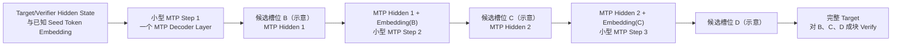

# MTP 推测解码：自回归串行、成块 Verify 与状态提交

> 日期：2026-07-26
> 来源：[Inbox](../../../inbox/2026-07-26.md)；Codex Session `019f99bd-bbfe-7fa1-b573-22d596a722dc`
> 状态：已整理

## 整理记录

- 2026-07-26 23:04：根据 22:35～22:38 的追问，补充递归式原生 MTP Draft、具体成本维度和 MTP-off/on 实验协议。
- 2026-07-26 22:24：补充 MTP 推理侧的 Draft、成块 Verify、最长有效前缀与 Cache/State 提交语义。
- 本文承接 [MTP Label、Loss 与参数更新](MTP标签损失与参数更新_20260726.md)，重点回答“训练后的多 Token 预测能力为什么可能加速自回归 Decode”。
- [2026-07-24 的训练与状态管理笔记](训练与RL后训练基础_20260724.md#7-mtp训练时多步预测推理时多-token-草拟)已经给出 Draft/Verify 入门；本文只展开本轮新出现的串行性、成块验证和状态所有权问题。
- 本文只记录公开且可跨项目复用的理论，不推断具体模型的 MTP 层数、Cache 布局或内部框架实现。

---

## 0. 这次真正要解决的矛盾

标准语言模型是自回归的：

```text
先有 B，才能定义 C 的条件分布；
先有 B、C，才能定义 D 的条件分布。
```

那么，为什么 MTP 或推测解码又说主模型可以“一次 Verify 多个 Token”？

还要同时回答：

1. MTP 推理是否主要发生在 Decode 阶段？
2. Draft Token 为什么不能直接交给用户？
3. Verify 是和“标准答案”比较吗？
4. B 被拒绝后，C、D 为什么也不能保留？
5. 接受 B、C 后，下一轮的正式上下文是什么？
6. Draft/MTP 的 KV 能否直接搬进主模型 KV Cache？
7. 哪些成本真正决定 MTP 是否加速？

---

## 1. 先给最短答案

### 1.1 自回归依赖没有消失

未知 Token 的正式生成仍然有因果顺序：

```text
P(B | A)
P(C | A,B)
P(D | A,B,C)
```

普通 Decode 不知道 B、C、D，因此完整主模型需要一轮一轮地产生它们。

推测解码先用较便宜的机制给出候选 `[B,C,D]`。候选一旦已知，目标模型便可以把它们作为输入，用 Causal Mask 在一个成块 Forward 中同时计算各位置的目标分布。

### 1.2 一轮推测解码的最短链路

```text
正式上下文 A
→ Draft 机制提出 [B,C,D]
→ 目标模型成块计算：
   q(B | A)
   q(C | A,B)
   q(D | A,B,C)
→ 按接受规则检查候选
→ 只提交可接受的连续前缀
→ 丢弃或截断未接受后缀的临时状态
→ 从新的正式边界继续下一轮
```

### 1.3 三个最重要的限定

1. **成块 Verify 不是并行生成未知 Token。** 候选已经由 Draft 机制给出；目标模型只是并行评分这些已知位置。
2. **Verify 不是对照训练 Label 判对错。** 推理时通常没有标准答案，它检查候选是否符合目标模型分布与相应接受规则。
3. **不要默认搬运 Draft KV 到目标模型。** 常规独立 Draft/Target 实现中，目标模型在 Verify 时计算自己的 KV/State；部分共设计架构可能显式共享状态，必须以实现为准。

---

## 2. 训练、Prefill、Decode 必须分开

### 2.1 NTP/MTP 训练不是 Decode

训练阶段拿到的是完整序列：

```text
[A,B,C,D]
```

程序用 Label Shift 构造 NTP/MTP 监督目标，通过 Forward、Loss、Backward 和 Optimizer 更新参数。

这里是在学习预测能力，不是在服务用户请求时逐 Token Decode。

### 2.2 推理先 Prefill 再 Decode

```text
Prompt
→ Prefill：并行处理已知 Prompt，建立正式 Prefix State
→ Decode 循环：
   Draft
   → Verify
   → Accept/Reject
   → 提交/回滚
   → 下一轮
```

因此更准确的说法是：

> MTP 作为推测解码的 Draft 机制时，主要服务于推理的 Decode 循环。

但目标模型对候选块的 Verify，在计算形态上又类似一个很短的增量 Prefill：候选 Token 已知，可以成块输入并用 Causal Mask 计算。

### 2.3 “NTP 学习就是 Decode”为什么不准确

两者使用相同的自回归条件概率目标，却属于不同阶段：

| 阶段 | Token 是否已知 | 是否更新参数 | 主要动作 |
|---|---:|---:|---|
| NTP/MTP 训练 | 完整训练序列已知 | 是 | 用 Label 计算 Loss |
| Prompt Prefill | Prompt 已知 | 否 | 建立 Prefix KV/State |
| 普通 Decode | 下一个 Token 未知 | 否 | 逐步正式生成 |
| 推测 Decode | Draft 候选暂时已知 | 否 | 成块 Verify 后提交 |

---

## 3. 为什么自回归仍能成块 Verify

### 3.1 生成未知 Token 与评分已知 Token 不同

普通 Decode：

```text
不知道 B
→ 主模型产生 B
→ 才能把 B 放入上下文并产生 C
→ 再产生 D
```

推测解码：

```text
便宜 Draft 已提出 B、C、D
→ B、C、D 对目标模型已经是待评分的已知输入
→ 目标模型可以一次处理这个候选块
```

### 3.2 Causal Mask 保留正确依赖

成块 Verify 不表示所有位置互相看见：

| 被验证候选 | 目标模型允许使用的条件 |
|---|---|
| B | A |
| C | A、B |
| D | A、B、C |

候选块内部仍然使用下三角因果关系：

```text
B 不能看 C、D
C 不能看 D
D 可以看 B、C
```

GPU 可以在同一层里并行计算多个候选位置，但 Transformer Layer 之间仍需按深度顺序执行。这里减少的是昂贵目标模型的串行 Decode 轮数，不是消灭所有计算依赖。

这种成块计算也不只是“多个 Token 一起做 FFN”：FFN 对不同 Token 位置天然可以成块应用同一组权重；Attention 则在 Causal Mask 下成块计算候选位置的 Q/K/V 与注意力。潜在收益来自完整 Target Stack 的 Attention、FFN、权重读取和 Kernel 形态共同改善。

### 3.3 为什么它像短块 Prefill

Prefill 能并行处理 Prompt，是因为 Prompt Token 已经给定。

Verify 能成块处理 Draft，原因相同：Draft Token 也已经给定，只是尚未被正式接受。

区别在于：

- Prompt 是用户提供或已经确认的正式上下文；
- Draft 是临时候选；
- Verify 后只有被接受的部分才能进入正式历史。

### 3.4 “一次 Verify”不等于“一次单 Token Decode 的成本”

目标模型需要计算多个候选位置，因此一次 Verify 的 FLOPs 和状态写入通常多于一次单 Token Decode。

它之所以仍可能更划算，是因为：

- 少了多轮目标模型串行调用；
- 权重读取与 Kernel Launch 可以被更大块的计算摊薄；
- 矩阵运算规模更适合 GPU；
- 已确认 Prefix 的 KV/State 仍可复用；
- 一次成功 Verify 可以提交多个正式 Token。

---

## 4. Draft 不是正式答案，Verify 也没有训练 Label

### 4.1 Draft 只是提案

```text
当前正式上下文：[A]
Draft：[B,C,D]
```

此时 B、C、D 都不能直接交给用户，因为它们来自较便宜或近似的提案机制。

目标模型必须计算自己对这些位置的分布，再应用接受规则。

### 4.2 Verify 检查的是目标分布

推理阶段通常不存在：

```text
Draft Token
vs.
数据集中的唯一正确 Label
```

更准确的是：

```text
Draft 分布或 Draft 选择
vs.
目标模型分布
```

“Accept”表示该候选满足当前解码算法相对于目标模型的接受条件，不表示它在事实或语义上被证明“正确”。

### 4.3 Greedy 场景

Greedy Decoding 下可以用直观规则理解：

```text
Draft 候选
是否等于目标模型在该位置的 Argmax Token
```

从第一个不匹配位置起，线性候选后缀不能继续直接采用。由于并行和串行计算路径可能存在浮点数值差异，不应无条件承诺逐 Token Bit-identical。

### 4.4 Sampling 场景

Sampling 不能机械套用“与 Argmax 相同就接受”。

经典两模型推测采样中，设 Draft 分布为 `p`，目标分布为 `q`，Draft 采到候选 `x`。典型接受概率是：

```text
min(1, q(x) / p(x))
```

如果拒绝，还要从归一化后的 `max(0, q-p)` 残余分布中采样替代 Token。这样可以保持目标模型经过 Temperature、Top-k、Top-p 等相同采样处理后的分布，误差范围仍受硬件数值计算影响。

这是经典算法的说明，不代表所有 MTP、树形候选或框架实现逐字采用同一数据结构与流程。检查实际系统时必须确认：

- Greedy 还是 Sampling；
- 线性候选还是候选树；
- Draft/Target 概率怎样保存；
- Reject 后怎样校正采样；
- 是否保持目标模型的处理后采样分布。

---

## 5. 为什么只能接受最长有效前缀

### 5.1 B、C 接受，D 拒绝

```text
正式 Prefix：[A]
Draft：[B,C,D]

B Accept
C Accept
D Reject
```

线性候选语义下：

```text
提交 B、C
丢弃 Draft D
正式上下文推进到 [A,B,C]
```

经典算法会在首个拒绝位置再从目标分布或校正后的残余分布得到一个替代 Token；如果所有候选都接受，还可能用最后一组目标 Logits 额外产生一个 Token。是否在同一轮提交这个 Token，以具体算法为准。

### 5.2 B 一开始就拒绝

```text
B Reject
→ B、C、D 这条 Draft 后缀都不能直接保留
```

原因是：

```text
C 的候选语义建立在 Draft B 已进入上下文之上
D 的候选语义建立在 Draft B、C 已进入上下文之上
```

一旦正式序列不采用 B，原候选 C、D 对应的条件上下文就已经改变。目标模型虽然可能已经并行算出了后续位置的 Logits，但这些结果也建立在被拒绝的 B 上，不能继续用于原线性路径。

### 5.3 下一轮上下文不是只有 B、C

若原正式历史是 `[A]`，接受 B、C 后：

```text
新的正式上下文 = 原历史 + 接受前缀
               = [A,B,C]
```

B、C 是本轮新增部分；A 仍然属于完整逻辑历史。若算法在拒绝位置又提交了一个目标 Token，新的边界还应包含它。

### 5.4 线性前缀与树形候选

“首个 Reject 后后续全部作废”直接适用于单链 Draft。

树形推测解码可能同时提出多条分支。某个节点被拒绝时，应作废的是该被拒分支的后代，不能泛化成整棵树的所有其他独立分支都失效。

无论物理布局怎样，核心约束都是：

> 只提交与最终正式 Token 路径一致的状态，其他路径状态必须释放或失效。

---

## 6. 正式状态、临时状态与 Cache 所有权

### 6.1 先建立逻辑抽象

无论具体框架怎样管理内存，都先区分：

```text
正式状态：
已经被目标解码过程确认，可作为下一轮真实历史

临时状态：
为 Draft/Verify 候选预先计算，尚未承诺
```

Accept/Reject 本质上类似一次状态事务：

```text
Accept → 提交对应 Token 路径与状态
Reject → 丢弃、截断或回滚未提交后缀
```

“丢弃”是逻辑语义；物理实现可能只是修改长度、页表、指针或有效位，不一定发生大块内存复制或立即清零。

### 6.2 常规独立 Target 会计算自己的 KV/State

当目标模型成块 Verify `[B,C,D]` 时，它执行自己的层计算，并形成目标模型对应的候选状态。

若接受 B、C、拒绝 D：

```text
目标模型为 B、C 计算的有效 KV/State
→ 可以成为新的正式目标状态

目标模型为 D 或其他拒绝后缀计算的状态
→ 截断、释放或标记失效
```

这是常规独立 Draft/Target 双模型方案的默认语义，不是所有共设计架构的普遍定理。

### 6.3 为什么不能泛化成“把 MTP KV 搬到主模型”

独立 Draft Model 与目标模型可能具有不同的：

- 层数和 Hidden Size；
- Attention Head 与 KV Head 数；
- 参数值与表示空间；
- Cache 格式和并行切分；
- Position、Block Table 与内存布局。

因此 Draft 模型的 KV 通常不能直接当作目标模型 KV 使用。

更稳妥的说法是：

> Draft 负责提出 Token；目标模型 Verify 时计算目标模型有效的概率与状态。

### 6.4 不同架构仍可能共享部分计算

不能从上一节反推“任何 MTP 都一定有两套完全独立 Cache”。

- 独立小 Draft Model 往往维护自己的 Cache；
- 集成式 MTP 模块可能共享主干 Hidden State、Embedding 或部分状态；
- Self-speculative、共享层、EAGLE 等共设计方案可能显式复用目标状态；
- 某些架构特定实现会让 Assistant Layer 与 Target 共享 KV Cache；
- 带递归状态的模型还可能维护非 KV 状态。

所以跨项目通用检查问题应是：

```text
谁生成这份状态？
它属于 Draft、Target，还是明确设计的共享状态？
哪些位置已经正式提交？
Reject 后逻辑长度、Position 与物理存储是否一致？
```

而不是先假设存在一次“KV 搬运”。

### 6.5 两侧状态都要重新对齐

如果 Draft 机制维护自己的增量状态，它也必须在每轮后对齐到新的正式 Token 边界。

目标侧和 Draft 侧可能分别需要处理：

- 接受前缀长度；
- Reject 位置；
- 目标模型给出的替代 Token；
- Position ID；
- KV/递归状态长度；
- Paged Cache 的 Block 映射；
- 多请求隔离。

---

## 7. 加速到底来自哪里

### 7.1 一个面向实测的成本模型

设：

- `k`：本轮提出的 Draft 长度；
- `C_draft(k)`：生成候选的成本；
- `C_verify(k)`：目标模型成块 Verify 的成本；
- `C_state(k)`：提交、回滚和调度成本；
- `Δ`：本轮最终提交的正式 Token 数；
- `C_decode`：普通目标模型产生一个 Token 的 Decode 成本。

推测解码更可能有收益的条件是：

```text
[C_draft(k) + C_verify(k) + C_state(k)] / E[Δ]
<
C_decode
```

也就是每个最终提交 Token 的平均成本更低。

### 7.2 论文中的简化理论模型

经典分析常记：

- `γ`：每轮 Draft Token 数；
- `α`：平均逐 Token 接受率，并近似假设各位置独立同分布；
- `c`：Draft 单步 Wall Time 与 Target 单步 Wall Time 的比值；
- Target 对短块并行评分成本近似一次普通 Target Step。

在这些假设下，每轮期望产出 Token 数可写成：

```text
E[N] = (1 - α^(γ+1)) / (1 - α)
```

理论 Wall-time Speedup 为：

```text
S = (1 - α^(γ+1))
    / [(1 - α) × (γc + 1)]
```

它不是生产环境保证。真实系统还受到接受事件相关性、Verify 块成本、输出长度、Cache、Kernel、调度、Batch、并发和通信影响。

### 7.3 为什么高接受率和低 Draft 成本都重要

如果 Draft 三个 Token：

```text
经常接受 3 个
→ 一次 Verify 推进多步

经常只接受 0～1 个
→ Draft 和块 Verify 的额外工作难以摊薄
```

同时，Lookahead 也不是越长越好。候选越长，Draft、Verify、临时状态和尾部浪费都可能增加；平均速度可能进入平台期甚至回退。

### 7.4 Verify 为何可能比多轮 Decode 更适合 GPU

大模型单 Token Decode 经常受权重读取、内存带宽、Kernel Launch 和小矩阵利用率限制。

成块 Verify 把多个候选位置放进更大的计算块，可能：

- 提高算术强度；
- 更充分利用 Tensor Core；
- 减少目标模型串行轮次；
- 摊薄固定调度开销。

但不同 Batch、并发、硬件和模型结构下结论可能变化。更大的 Verify 块也会增加 FLOPs、临时内存和 Cache 写入。

### 7.5 KV Cache 复用是收益的一部分

已确认 Prefix 的目标模型 KV 会继续复用；目标模型不需要从头重算整个历史。

但加速不能简化成“因为复用了更多 KV”：

- 普通 Decode 本来也复用 Prefix KV；
- 推测解码还增加了 Draft、Verify 和回滚成本；
- 主要新增机会是一次目标 Forward 提交多个 Token，以及由此改善硬件利用率。

### 7.6 最少应记录的性能指标

```text
功能正确性：
最终是否保持目标解码语义或处理后的采样分布

Draft 质量：
逐位置接受率、接受前缀长度、每轮平均接受数

成本：
Draft Latency、Verify Latency、状态处理与通信开销

最终收益：
Tokens/Target Forward、TPOT/ITL、Tokens/s、
端到端延迟、P90/P99、额外 FLOPs 与显存
```

只看 MTP Loss 下降，不能推出推理一定加速。

### 7.7 上平台后怎样做 MTP-off/on 对照

“框架支持 MTP”不是性能结论。实际接入后应先验证语义正确，再在同一条件下比较 MTP 关闭与开启：

| 控制或扫描项 | 建议做法 |
|---|---|
| 固定条件 | 同一 Checkpoint、Tokenizer、Prompt 集、输出上限、采样参数、精度、引擎版本、硬件、并行配置与预热方式 |
| 负载分桶 | 分别扫描 Batch/QPS、并发、输入长度与输出长度，不用单个平均值代表全部流量 |
| 解码设置 | Greedy 与 Sampling 分开；扫描 Draft Length、Temperature、Top-k/Top-p 等会改变接受率的参数 |
| 正确性 | Greedy 检查目标解码语义；Sampling 检查处理后分布，而不是要求每次随机输出逐 Token 相同 |
| 状态安全 | 专门覆盖首 Token Reject、部分接受、全部接受、请求结束与多请求交错，检查 Cache/State 边界 |
| 性能 | 对每个流量桶记录 7.6 的接受长度、Draft/Verify/状态延迟、TPOT/ITL、吞吐、尾延迟、GPU 利用率与显存 |

最终应报告“哪些负载区间加速、持平或变慢”，而不是只给一个脱离 Batch、QPS 和 Sampling 的总加速倍数。

---

## 8. MTP 与 Speculative Decoding 不能画等号

Speculative Decoding 是“先便宜提案、再由目标模型验证”的算法框架。

Draft 来源可以是：

- 独立小模型；
- 目标模型内部的 MTP 模块；
- 多个预测 Head；
- 候选树；
- N-gram 或其他启发式提案。

MTP 是其中一种候选生成能力。

同时，MTP 自身也不保证一次完全并行地产生全部 Draft：

- 独立 Head 可能并行提出不同未来 Offset；
- 连续 MTP 模块可能使用前一深度的表示或 Token Embedding；
- 某些 Draft 仍按较轻量的依赖路径逐步生成。

### 8.1 一种递归式原生 MTP Draft

下面是一种当前实现范式，用来具体化“较轻量的依赖路径”，不是所有 MTP 的通用定义。截至整理时，vLLM Speculators 的 MTP 文档描述的是一个预测层：它把 Verifier Hidden State 与 Token Embedding 融合后送入一个标准 Decoder Layer，并把输出 Hidden State 递归传给下一步。



图中的 B、C、D 只是“已确认边界之后的第 1～3 个 Draft 槽位”示意；具体 Token Shift 必须以实现为准。它们仍按依赖顺序提出；“便宜”并不是说它没有自回归步骤，而是每个 Draft Step 执行的模型路径可能远小于完整 Target：

| 比较维度 | 普通生成 `k` 个 Token | 递归式 MTP 推测一轮 |
|---|---|---|
| 执行路径 | `k ×` 完整 Target 全部 Layer | `k ×` 少量 MTP Layer，再加 `1 ×` 完整 Target 短块 Verify |
| 权重读取 | 每个单 Token Step 都经过整套 Target 权重 | Draft 只读较小模块；Target 权重由候选块中的多个位置摊销 |
| Kernel 形态 | 低 Batch 下常是小矩阵、易受显存带宽限制 | Verify 的候选维度更大，通常更容易利用 GPU |
| 最终判断 | Target 串行调用次数固定为 `k` | 还需计入 Accept/Reject、状态处理和未接受尾部；只比较实测 Wall Time |

因此正确的成本问题是：

```text
k × 小型 MTP Draft + 1 × Target Block Verify + 状态处理
是否小于
k × 完整 Target 单 Token Decode
```

**“像短块 Prefill”描述的是最后的 Target Verify，不是上图中仍可能串行的 Draft。** 具体 Checkpoint 也可能采用并行 Head、多个连续模块或其他共享方式，必须查看配置、参数和实际推理代码后再下架构结论。

训练了 MTP Objective 也不等于部署时自动加速。系统仍需：

```text
可用的 Proposer
→ Target Verifier
→ 正确的接受/校正规则
→ 状态提交与回滚
→ 服务框架支持
```

真正的性能要求是：

> Draft 总成本必须足够低，目标模型又能高效成块 Verify，并且平均接受足够长的前缀。

---

## 9. 一个完整例子

### 9.1 普通 Decode

```text
正式上下文：[A]

目标模型调用 1 → B
正式上下文：[A,B]

目标模型调用 2 → C
正式上下文：[A,B,C]

目标模型调用 3 → D
正式上下文：[A,B,C,D]
```

需要三轮串行目标模型 Decode。

### 9.2 MTP 辅助推测解码

```text
正式上下文：[A]

较便宜的 MTP Draft → [B,C,D]

目标模型一次成块 Verify：
q(B | A)
q(C | A,B)
q(D | A,B,C)

结果：
B Accept
C Accept
D Reject
```

之后：

```text
正式 Token 路径：至少推进到 [A,B,C]
目标正式状态：提交 A、B、C 对应边界
拒绝后缀：D 的候选与未提交状态失效
拒绝位置：按算法由 Target/Residual 决定替代 Token
下一轮：从算法最终确定的新边界继续
```

如果一次目标 Verify 提交了两个或更多 Token，并且 Draft/Verify 总开销低于对应的多轮普通 Decode，就可能获得加速。

---

## 10. 实现审查时的边界不变量

### 10.1 Token 路径

```text
下一轮可见的正式 Token
= 原正式历史
+ 本轮最终提交的 Token
```

任何被拒 Draft 或未选树分支都不能残留在逻辑历史中。

### 10.2 Target State

```text
Target 的有效状态
必须与 Target 已处理的正式前缀边界一致
```

不要机械假设 Cache 长度永远等于已经展示给用户的 Token 数。部分引擎可能保留一个尚待下一步处理的 Pending Token；必须以该实现对“已处理前缀”的定义为准。

### 10.3 Draft State

```text
Draft 下一轮的输入边界
必须与最新正式 Token 路径重新对齐
```

若首个 Reject 后目标模型补了一个新 Token，Draft 状态也必须消费或重建到包含这个 Token 的边界。

### 10.4 位置与内存元数据

至少联查：

- Sequence Length；
- Position ID；
- KV/递归状态长度；
- Cache Block Table；
- Page 引用或有效范围；
- Request ID 与 Batch Slot；
- Draft/Target 权重版本；
- Accepted Length 与提交 Token 日志。

---

## 11. 常见误解

| 容易误解为 | 更准确的理解 |
|---|---|
| MTP 消除了自回归依赖 | 依赖仍在；Draft 先把候选变成已知输入，Target 才能成块评分 |
| Target 一次并行生成 B、C、D | Draft 提出候选；Target 一次 Verify 多个已知候选位置 |
| B Reject 后 C、D 没有被计算 | 它们可能已经被 Block Forward 算出，但条件前缀失效，不能提交 |
| Verify 拿 Draft 与正确 Label 比较 | 推理通常没有 Label；接受规则依据目标模型分布 |
| Draft Token 可以直接输出 | 只有被接受并提交的 Token 才是正式输出 |
| 接受 B、C 后上下文只有 B、C | 完整正式上下文是原历史加 B、C，以及算法可能提交的替代/Bonus Token |
| MTP KV 会直接移动到主模型 KV | 常规双模型 Target 自己计算有效状态；共设计架构是否共享依实现而定 |
| 回滚一定是复制、删除或清零显存 | 回滚首先是逻辑失效，物理实现可能只改长度、页表或引用 |
| 一次 Verify 等于一次单 Token Decode 成本 | Verify 计算更多位置，但可能比多轮串行 Decode 更高效 |
| Draft 仍然串行，所以不可能加速 | 应比较每步执行路径：`k ×` 小型 MTP 加一次成块 Verify，仍可能快于 `k ×` 完整 Target Decode |
| Lookahead 越长越快 | 候选长度、接受率和 Draft/Verify 成本存在折中 |
| Acceptance Rate 高就一定加速 | 还要看接受长度、Draft/Verify/状态成本、Batch 和硬件利用率 |
| Speculative Decoding 与普通路径严格 Bitwise 相同 | 正确采样算法保持处理后的 Target 分布，但数值路径可能不同 |
| MTP 就是推测解码 | MTP 是可用于推测解码的 Proposer 之一 |

---

## 12. 一分钟复习

1. 普通 Decode 串行生成未知 Token；推测解码先用便宜机制给出候选。
2. 候选已知后，Target 能用 Causal Mask 成块计算各位置分布。
3. 成块 Verify 保留 `B←A`、`C←A,B`、`D←A,B,C` 的因果关系。
4. Verify 依据目标模型分布与接受规则，不是和训练 Label 对答案。
5. 单链 Draft 只能提交从开头起的连续有效前缀；首个 Reject 后的候选失效。
6. 树形候选中，应作废被拒分支的后代，而不是无条件丢弃所有分支。
7. 接受 B、C 后，新的完整上下文是原历史加 B、C，并可能含 Target 补充 Token。
8. 常规双模型 Target 在 Verify 中生成自己的 KV/State，不能默认直接复用 Draft KV。
9. 已接受状态提交，拒绝后缀逻辑失效；两侧状态都要与正式边界重新对齐。
10. 加速来自减少 Target 串行轮次并提高块计算效率，不只是 KV 复用。
11. MTP 不保证加速；必须联看接受长度和 Draft、Verify、状态处理总成本。
12. MTP 是一种 Proposer，不等于完整 Speculative Decoding 算法。
13. 递归式 Draft 可以串行；它可能更便宜，是因为每步只走少量 MTP Layer，而非完整 Target Stack。
14. “短块 Prefill-like”指候选已知后的 Target Verify，不是 Draft 在并行生成未知 Token。
15. 真正的加速结论必须来自同条件 MTP-off/on 实验，并按负载与采样设置分桶。

---

## 13. 自测问题

### 问题 1：自回归依赖没有消失，为什么 Target 仍能一次 Verify 多个 Draft Token？

期望回答：

Draft 已经提供候选 Token ID，因此 Target 是在评分已知候选位置，而不是并行生成未知 Token。Causal Mask 仍保证每个位置只使用其正确前缀。

### 问题 2：Draft 是 `[B,C,D]`，B 在第一个位置被拒绝，C、D 能保留吗？

期望回答：

在线性候选中不能。C 的条件上下文包含 Draft B，D 的条件上下文包含 Draft B、C；B 不进入正式历史后，原 C、D 候选的条件语义已经失效。

### 问题 3：B、C 接受，D 拒绝，下一轮完整正式上下文是什么？

期望回答：

至少是原正式历史 `[A]` 加已接受前缀 `[B,C]`，即 `[A,B,C]`。经典算法还可能在拒绝位置提交一个 Target 或残余分布 Token，具体以接受规则为准。

### 问题 4：Verify 为什么不是判断 Draft 是否“事实正确”？

期望回答：

推理时通常没有标准 Label。Verify 检查候选是否满足目标模型分布对应的接受规则，从而保持目标解码语义或处理后的采样分布。

### 问题 5：能否把独立 Draft Model 的 KV 直接当作 Target KV？

期望回答：

通常不能。两者参数、层数、表示空间和 Cache 布局可能不同；Target Verify 时会形成 Target-valid KV/State。共设计架构是否共享部分状态必须以实现为准。

### 问题 6：为什么 MTP 功能正确仍可能变慢？

期望回答：

若接受前缀短，或 Draft、块 Verify、回滚、通信和调度成本过高，每个最终提交 Token 的平均成本可能超过普通单 Token Decode。

### 问题 7：为什么“Lookahead 越长越快”不成立？

期望回答：

更长候选可能提高单轮最大推进量，也会增加 Draft、Verify、临时状态和被拒后缀浪费。最优长度取决于接受分布、模型、Batch、硬件和服务负载。

### 问题 8：递归式 MTP Draft 也要依次生成 B、C、D，为什么仍可能加速？

期望回答：

不能只数自回归步数，而要比较执行路径和 Wall Time。`k ×` 少量 MTP Layer 加一次 Target Block Verify，可能比 `k ×` 完整 Target 全层 Decode 更快；是否成立仍要通过 off/on 分桶实验确认。

---

## 14. 后续仍需深入

- 用最小张量例子展示 Target 一次 Forward 返回多个候选位置 Logits 的 Shift 对齐；
- 完整推导经典 Speculative Sampling 的接受概率与残余分布校正；
- 比较线性 Draft、候选树和多 Head MTP 的状态布局；
- 阅读目标推理框架的 Cache Block 分配、Commit 与 Rollback 实现；
- 按 7.7 的协议在实际平台执行 MTP-off/on 分桶实验，找出加速与退化的负载边界；
- 核对目标模型 MTP 模块是并行 Head、连续模块还是仅训练期辅助目标。

---

## 15. 参考材料

- [Fast Inference from Transformers via Speculative Decoding](https://proceedings.mlr.press/v202/leviathan23a/leviathan23a.pdf)：成块 Target 评分、连续接受前缀、分布校正与简化加速模型。
- [Accelerating Large Language Model Decoding with Speculative Sampling](https://arxiv.org/pdf/2302.01318)：Draft/Target 推测采样、接受概率、残余分布与延迟实验。
- [Better & Faster Large Language Models via Multi-token Prediction](https://arxiv.org/pdf/2404.19737)：MTP 训练目标及其作为 Self-speculative Proposer 的方式。
- [DeepSeek-V3 Technical Report：MTP](https://arxiv.org/html/2412.19437#S2.SS2)：连续 MTP 模块，以及训练辅助模块可丢弃或用于推测解码的实例。
- [llama.cpp Speculative Decoding](https://github.com/ggml-org/llama.cpp/blob/master/docs/speculative.md)：独立 Draft Model、MTP、EAGLE、N-gram 等多类 Proposer 的官方实现说明。
- [vLLM MTP](https://github.com/vllm-project/vllm/blob/main/docs/features/speculative_decoding/mtp.md)：原生 MTP 部署入口，以及特定 Assistant Layer 与 Target 共享 KV Cache 的架构例外。
- [vLLM Speculators MTP](https://docs.vllm.ai/projects/speculators/en/latest/user_guide/algorithms/mtp/)：单预测层结合 Verifier Hidden State 与 Token Embedding，并递归传递 MTP Hidden State 的一种实现范式。
- 前置笔记：[MTP Label、Loss 与参数更新](MTP标签损失与参数更新_20260726.md)。
- 前置笔记：[从预训练到 RL 后训练：MTP 与状态管理基础](训练与RL后训练基础_20260724.md#7-mtp训练时多步预测推理时多-token-草拟)。
