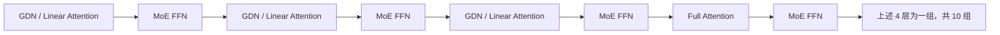
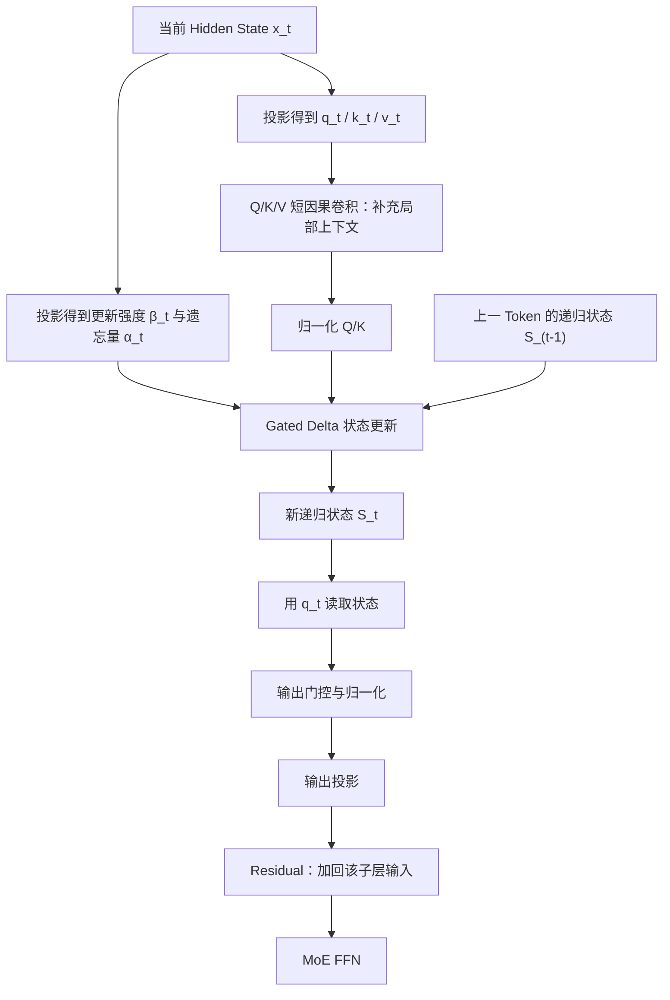

# Qwen3.5 混合架构与 Gated DeltaNet（GDN）领读

> 日期：2026-07-31
>
> 适用阶段：Qwen3 30B MTP 基础正确性验证完成后，开始调研 Qwen3.5 35B-A3B MTP 适配
>
> 本文目标：先掌握足以阅读 Qwen3.5 训练/推理实现、定位 MTP 适配风险的 GDN 最小完整理论；暂不推导并行 Kernel 和反向传播。

---

## 0. 先记住这一句话

**Gated DeltaNet（GDN）是一种带可遗忘递归状态的线性 Attention。**

它不为历史中的每个 Token 永久保存一份 K/V，而是把过去压缩进一个固定大小的状态矩阵：

```text
旧状态
  ├─ 先由 Gate 决定保留多少
  ├─ 再用 Delta Rule 定向修正当前 Key 对应的记忆
  └─ 用当前 Query 从新状态中读取结果
```

因此：

- Full Attention 像“保留全部原始资料，需要时逐条检索”；
- 普通 Linear Attention 像“不断把资料写进一张固定大小的摘要表”；
- DeltaNet 像“写入前先检查原记录，只写误差修正”；
- Gated DeltaNet 再增加“按当前内容决定忘掉多少旧记忆”的能力。

Qwen3.5 没有把所有 Full Attention 都替换掉，而是把三层 GDN 和一层 Full Attention 组成一组，重复十次。它用 GDN 获得长序列效率，又定期用 Full Attention 做精确的全局检索。

---

## 1. 先看清 Qwen3.5-35B-A3B 的四个维度

### 1.1 文本主干

官方配置中的 40 层按下面的规律排列：



也就是：

```text
[
  GDN            → MoE
  GDN            → MoE
  GDN            → MoE
  Full Attention → MoE
] × 10
```

最终得到：

- 40 个 Transformer Decoder Layer；
- 30 层 GDN；
- 10 层 Full Attention；
- 每一层 Token Mixer 后面都有 MoE FFN；
- 256 个 Routed Experts，每个 Token 选择 8 个，另有 Shared Expert；
- Checkpoint 原生包含 1 层 MTP。

### 1.2 这四个概念不能混在一起

| 维度 | 回答的问题 | Qwen3.5 中的答案 |
|---|---|---|
| GDN / Full Attention | Token 之间怎样交换、检索历史信息？ | 3:1 混合 |
| Dense FFN / MoE FFN | 每个 Token 经过什么非线性计算？ | MoE |
| NTP / MTP | 一次训练或草拟预测几个未来位置？ | 主干 NTP + 原生 1 层 MTP |
| TP / PP / EP / CP | 模型与序列怎样分到设备上？ | 由训练/推理部署配置决定 |

所以，**GDN 不是 MoE，MoE 也不替代 Attention**：

```text
Hidden State
→ GDN 或 Full Attention：Token Mixing
→ Residual
→ MoE FFN：Channel Mixing / 非线性变换
→ Residual
→ 下一层 Hidden State
```

---

## 2. 为什么要从 Full Attention 改造

### 2.1 Full Attention 保存了什么

对当前 Token 的 Query `q_t`，标准 Attention 会与历史所有 Key 做匹配：

```text
q_t 与 k_1, k_2, ..., k_t 分别计算相关性
→ 得到 Attention 权重
→ 对 v_1, v_2, ..., v_t 加权求和
→ 得到当前输出 o_t
```

直觉仍然是：

- Query：我现在想找什么；
- Key：每段历史内容的检索地址/特征；
- Value：匹配后真正读取的内容。

它的优势是历史 Token 的 K/V 仍然分别存在，因此能够做细粒度、内容寻址的检索。

代价是：

- 训练或 Prefill 时，长度为 `L` 的序列产生近似 `L × L` 的 Token 交互；
- Decode 时，当前 Query 仍要读取历史 KV Cache；
- 上下文越长，KV Cache 越大，单步读取带宽越高，并发通常越低。

### 2.2 Linear Attention 想解决什么

Linear Attention 不再永久保留每个历史位置的独立 K/V，而是维护固定大小的状态矩阵 `S_t`。

这里统一使用：

```text
S_t ∈ R^(d_v × d_k)
```

最朴素的递推形式是：

```text
S_t = S_(t-1) + v_t k_t^T
o_t = S_t q_t
```

其中 `v_t k_t^T` 是一个外积，它把“Key 方向”与“Value 内容”关联并写入状态。

你可以把 `S_t` 看成一张固定大小的联想记忆表：

```text
写：Key k_t → Value v_t
读：用 Query q_t 查询状态 S_t → 输出 o_t
```

### 2.3 它为什么叫“线性”

这里的“线性”主要是相对序列长度 `L` 而言，不是说整个神经网络只做线性函数。

- Full Attention 显式形成 Token 两两关系，序列交互量随 `L²` 增长；
- Linear Attention 沿序列逐步更新固定状态，序列维度的工作量随 `L` 近似线性增长；
- 模型里仍然有投影、门控、卷积、归一化、MoE 和各种非线性。

---

## 3. 普通 Linear Attention 的问题：只会累加，不会纠错

朴素更新是：

```text
S_t = S_(t-1) + v_t k_t^T
```

它存在两个直观问题。

### 3.1 相似 Key 会互相干扰

如果多个 Token 的 Key 很接近，它们的 Value 会不断叠加到相似方向。之后用相似 Query 读取时，容易同时读到多份内容，产生串扰。

### 3.2 旧信息不能主动删除

普通加法只能不断写入。即使过去的信息已经不适用于当前语境，也没有明确机制把它擦掉。

这就是 Delta Rule 和 Gate 分别要解决的问题：

```text
Delta Rule：不要盲目追加，先看当前记忆预测错了多少，再写纠正量。
Gate：根据当前输入，决定旧状态整体应该保留多少。
```

---

## 4. DeltaNet：把“追加写入”改成“误差修正”

### 4.1 先查询当前状态已经记住了什么

当前 Key 是 `k_t`。在写入新 Value 之前，先从旧状态查询：

```text
v_old = S_(t-1) k_t
```

这代表旧状态认为 `k_t` 对应的内容是什么。

### 4.2 只写新目标与旧预测之间的误差

目标内容是 `v_t`，旧预测是 `v_old`，误差为：

```text
error_t = v_t - S_(t-1) k_t
```

于是 Delta 更新写入：

```text
S_t = S_(t-1) + β_t · error_t · k_t^T
```

也就是：

```text
S_t = S_(t-1)
    + β_t (v_t - S_(t-1)k_t) k_t^T
```

`β_t` 表示这次写入/修正的强度。

### 4.3 用“通讯录”理解 Delta Rule

假设状态里已有：

```text
张三 → 旧电话号码
```

现在收到张三的新号码：

- 普通累加像在旧号码旁边再抄一个新号码，查询时可能混在一起；
- Delta Rule 先读取当前号码，再把“旧号码到新号码的差值”写回这个地址；
- 因而它更接近定向覆盖/纠正，而不是无条件叠加。

### 4.4 不要把这里的 Delta Rule 当成 Optimizer

这是当前最重要的概念边界：

- GDN 的 Delta 更新发生在模型 **Forward 内部**，每个 Token 都会更新临时递归状态；
- Backward/Optimizer 更新的是模型可训练参数；
- 前者是“本次序列推理期间的工作记忆”，后者是“跨 Batch 保留下来的模型知识”。

Forward 结束后，如果没有跨请求的状态复用，递归状态不会像权重一样被 Optimizer 永久保存。

---

## 5. Gated DeltaNet：在定向纠错前增加可学习遗忘

### 5.1 完整直觉公式

在统一的矩阵方向下，可以写成：

```text
S_t = α_t S_(t-1)
    + β_t (v_t - α_t S_(t-1)k_t) k_t^T

o_t = S_t q_t
```

这里默认 Key 做了适当归一化；论文或代码为了并行计算可能写成等价但外观不同的形式。

分三步看最容易：

```text
1. Forget：S_old' = α_t S_(t-1)
2. Correct：S_t = S_old' + β_t (v_t - S_old' k_t) k_t^T
3. Read：   o_t = S_t q_t
```

### 5.2 `α_t` 与 `β_t` 各自负责什么

| 量 | 含义 | 直觉 |
|---|---|---|
| `α_t` | Retention/Decay Gate | 旧状态保留多少；接近 1 表示多保留，较小表示多遗忘 |
| `β_t` | Update/Write Gate | 当前误差修正写多强 |
| `k_t` | 写入地址 | 要修正状态的哪个方向 |
| `v_t` | 新目标内容 | 希望该地址以后读出什么 |
| `q_t` | 读取请求 | 当前真正想从状态中读什么 |

一句话区分：

```text
α 控制“旧的整体留多少”；
β 控制“新的这次写多少”。
```

### 5.3 为什么既要 Gate 又要 Delta

- 只有 Delta：能够定向纠正某个 Key 方向，但缺少更灵活的全局遗忘能力；
- 只有 Gate：能够衰减旧状态，但写入仍可能是粗糙累加；
- Gate + Delta：既能清理不再有用的历史，又能在目标 Key 方向做精确误差修正。

这也是 GDN 比“普通线性 Attention”更接近可用长期工作记忆的关键。

---

## 6. 一个 Token 在 GDN 层里实际经历什么

可以先按下面的概念流阅读代码：



Qwen3.5 官方配置可看到这类关键参数：

- Linear Key Heads：16；
- Linear Value Heads：32；
- Key Head Dim：128；
- Value Head Dim：128；
- Q/K/V 短卷积 Kernel Size：4。

这些不是 Full Attention 的 KV Head 配置。Qwen3.5 的 Full Attention 层另有：

- 16 个 Query Heads；
- 2 个 KV Heads；
- Attention Head Dim：256。

因此工程实现不能把 GDN State 的布局误当成 Full Attention KV Cache 的布局。

---

## 7. 递归状态与 KV Cache 到底有什么不同

### 7.1 Full Attention 的 KV Cache

```text
Token 1 → 保存 K_1, V_1
Token 2 → 保存 K_2, V_2
...
Token L → 保存 K_L, V_L
```

Cache 随序列长度增长，优点是每个历史位置仍然可以被单独访问。

### 7.2 GDN 的递归状态

```text
S_0
→ 读入 Token 1 后得到 S_1
→ 读入 Token 2 后得到 S_2
...
→ 读入 Token L 后得到 S_L
```

只需要保留当前状态，不必把所有 `S_1 ... S_(L-1)` 都留给 Decode。其状态大小原则上不随已生成序列长度线性增加。

但这不是“无损压缩”：多个 Token 的信息被压入同一固定状态，精确随机检索能力通常不如保存全部 K/V 的 Full Attention。

### 7.3 Qwen3.5 是混合 Cache

Qwen3.5 推理时至少要维护两类历史状态：

```text
30 个 GDN Layer：短卷积状态 + Gated Delta 递归状态
10 个 Full Attention Layer：逐 Token 增长的 KV Cache
```

所以“Qwen3.5 没有 KV Cache”是错的。正确说法是：

> 大多数 GDN 层用固定大小递归状态替代逐 Token KV Cache，但周期性的 Full Attention 层仍然需要 KV Cache。

---

## 8. 为什么仍要每四层放一个 Full Attention

### 8.1 GDN 擅长的事情

- 固定状态的流式处理；
- 长上下文下减少随序列增长的 Cache；
- 将持续出现的模式、局部与近期信息更新进工作记忆；
- Decode 时按 Token 递归更新。

### 8.2 Full Attention 擅长的事情

- 保留每个历史 Token 的独立 K/V；
- 根据当前 Query 重新选择任意历史位置；
- 做更精确的全局、内容寻址检索；
- 避免所有历史都必须挤进固定大小状态。

### 8.3 混合的直觉

```text
连续三层 GDN：高效地压缩、更新和传播历史
每第四层 Full Attention：回到原始 Token 级记忆做一次全局校准/检索
```

“3:1 一定是数学最优”不是本文要下的结论；它是该模型配置选择的工程与效果折中。

---

## 9. Training、Prefill、Decode 都使用这套架构

GDN 不是推理侧外挂功能，而是模型主干架构。训练和推理必须遵守同一计算定义。

### 9.1 Training

训练时需要得到整段序列每个位置的输出并反向传播。虽然递归定义看起来必须逐 Token 串行：

```text
S_0 → S_1 → S_2 → ... → S_L
```

实际实现会使用 Chunkwise Parallel 等等价算法，在块内并行、块间传递状态，从而利用 GPU 并行能力。**递归数学定义不等于代码一定写成 Python for-loop。**

### 9.2 Prefill

Prompt 的大量 Token 一次进入模型。GDN 层通过并行/分块实现建立 Prompt 结束处的最终递归状态；Full Attention 层建立相应 KV Cache。

Prefill 完成后的逻辑状态是：

```text
GDN：S_prompt_end + 卷积尾部状态
Full Attention：Prompt 所有位置的 KV Cache
```

### 9.3 Decode

每生成一个新 Token：

```text
GDN Layer：读取旧递归状态 → 更新一次 → 产出本层 Hidden State
Full Attention Layer：追加新 K/V → 当前 Q 读取全部有效 KV
```

最终一层 Hidden State 经过 LM Head 得到 Logits，再采样/选择下一个 Token。

---

## 10. GDN 与 Qwen3.5 MTP 的关系

### 10.1 原生一层 MTP 是什么含义

`mtp_num_hidden_layers: 1` 表示 Checkpoint 设计里包含一个额外的未来 Token 预测模块。它与主干 40 层不是“第 41 个普通主干层”，而是服务于额外未来位置预测的模块。

根据当前 vLLM 的 Qwen3.5 MTP 参考实现，这个 MTP Decoder Block 使用 **Full Attention + MoE**，而不是再复制一层 GDN。

这对适配的直接启示是：

```text
主干加载：必须支持 30 GDN + 10 Full Attention + MoE
MTP 加载：必须额外识别 MTP Fusion/Block/Norm 等参数
MTP Block：不能因为主干多数是 GDN 就默认它也是 GDN
```

### 10.2 推测解码中的状态提交更复杂

MTP 草拟多个候选后，Target 只接受最长有效前缀。对于纯 Full Attention 模型，通常重点处理 KV Cache 的提交/截断；对 Qwen3.5 混合架构，还要保证：

- Full Attention KV Cache 停在相同的已接受 Token 边界；
- GDN 递归状态停在相同边界；
- GDN 短卷积状态也停在相同边界；
- 被拒绝候选产生的临时状态不能污染正式状态。

具体是复制、重算、事务提交还是后端专用 Cache 接口，属于框架实现细节；但**多类状态的逻辑 Token 边界必须一致**，这是正确性契约。

---

## 11. 从 Qwen3 30B MTP 迁移到 Qwen3.5 时为什么更难

Qwen3 的当前验证经验仍然能复用：

- MTP 参数发现与构建；
- HF/Megatron 参数映射与 Exact-set 检查；
- MTP Label、Loss、Backward、Optimizer；
- Actor 到 Rollout 的在线权重同步；
- 版本号与第二步 Rollout 消费新权重；
- Draft/Verify 的接受正确性。

Qwen3.5 新增的主要变量是：

| 变化 | 可能影响 |
|---|---|
| 30 层 GDN + 10 层 Full Attention | Layer Spec、Module 构建、Forward 分支 |
| GDN 特有参数 | HF ↔ Megatron 名称、Shape 与分片映射 |
| 递归状态 + 卷积状态 | Prefill/Decode、Cache 生命周期与回滚 |
| 不同 Attention Head 配置 | 不能套用单一 MHA/GQA KV 规则 |
| 混合层顺序 | Layer Index 到类型的映射必须精确 |
| MTP Block 使用 Full Attention | MTP 不能机械复制相邻主干 GDN 层 |
| Prefix Cache / Chunk Prefill | 状态切分与前缀复用需后端明确支持 |

所以 Qwen3.5 的难点不是“再加一组参数名”，而是模型从单一 Token Mixer 变成了混合状态机。

---

## 12. 当前任务阶段必须掌握什么，可以暂缓什么

### 12.1 现在必须掌握

1. GDN 用固定大小递归状态，不是逐 Token KV Cache；
2. `q` 负责读取，`k` 负责寻址，`v` 是写入目标；
3. Delta Rule 写的是“新目标减旧预测”的误差；
4. `α` 控制遗忘/保留，`β` 控制当前更新强度；
5. Qwen3.5 是 3 层 GDN + 1 层 Full Attention，共 40 层；
6. GDN/Full Attention 是 Token Mixer，MoE 是之后的 FFN；
7. Training、Prefill、Decode 都使用 GDN，只是执行方式不同；
8. Qwen3.5 推理同时拥有 GDN State 和 Full Attention KV Cache；
9. 推测解码的接受/回滚必须让所有状态停在同一 Token 边界；
10. 原生一层 MTP 的参考 Block 是 Full Attention，不能照主干多数层猜测。

### 12.2 先记录、后续按代码需要再学

- Chunkwise Parallel 的严格推导；
- WY Representation；
- CUDA/Triton/FLA Kernel；
- GDN Backward 的中间状态保存与重算；
- 多级 Chunk/Persistent Cache 优化；
- Qwen3.5 Prefix Cache 的不同后端模式；
- GDN State 在 TP/CP 下的精确张量切分和通信；
- 长上下文基准中不同层比例的消融实验。

这部分不会阻塞第一版模型结构、参数映射和单步训练链路调研。

---

## 13. 带着问题领读资料：建议顺序

### 第一遍：15～20 分钟，只建立直觉

阅读 Songlin Yang 的博客 [Parallelizing Linear Transformers with the Delta Rule over Sequence Length](https://sustcsonglin.github.io/blog/2024/deltanet-1/)。

只回答四个问题：

1. 普通 Linear Attention 怎样把历史压进 `S_t`？
2. 固定状态为什么可能发生记忆干扰？
3. Delta Rule 为什么先算 `v_t - S_(t-1)k_t`？
4. 递归公式为什么仍能通过分块算法并行？

第一次不要卡在并行推导和矩阵恒等式。

### 第二遍：30～40 分钟，看 GDN 论文的贡献边界

阅读 [Gated Delta Networks: Improving Mamba2 with Delta Rule](https://arxiv.org/abs/2412.06464) 的 Abstract、Introduction、方法总览和架构图。

重点寻找：

- Gate 怎样提供数据依赖的遗忘；
- Delta Rule 怎样做选择性更新；
- GDN 为什么适合与 Full Attention 组成 Hybrid；
- Chunkwise Parallel 解决的究竟是训练吞吐还是模型语义。

严格公式推导与 Kernel 实验表可以第二轮再读。

### 第三遍：20～30 分钟，把论文映射到 Qwen3.5 配置

对照：

- [Qwen3.5-35B-A3B 官方模型卡](https://huggingface.co/Qwen/Qwen3.5-35B-A3B)；
- [官方 config.json](https://huggingface.co/Qwen/Qwen3.5-35B-A3B/raw/main/config.json)；
- [Transformers 中 Qwen3.5-MoE 实现](https://github.com/huggingface/transformers/blob/main/src/transformers/models/qwen3_5_moe/modeling_qwen3_5_moe.py)。

这一遍只做三张表：

1. Layer Index → `linear_attention` / `full_attention`；
2. GDN 参数名 → q/k/v、a/b、conv、norm、output gate；
3. Full Attention 参数名 → q/k/v/o projection 与 head 配置。

### 第四遍：结合当前任务看 vLLM/Megatron 接入

依次查看：

- [vLLM Qwen3.5 主模型实现](https://github.com/vllm-project/vllm/blob/v0.17.0/vllm/model_executor/models/qwen3_5.py)；
- [vLLM Qwen3.5 MTP 实现](https://github.com/vllm-project/vllm/blob/v0.17.0/vllm/model_executor/models/qwen3_5_mtp.py)；
- [Megatron Bridge 的 Qwen3.5 支持说明](https://docs.nvidia.com/nemo/megatron-bridge/latest/models/qwen/qwen35-vl.html)。

带着工程问题读：

1. Layer Spec 怎样区分 GDN 与 Full Attention？
2. HF 参数怎样映射到训练框架？
3. MTP Block 为什么单独定义？
4. GDN State 在推理 Worker 中由谁持有、何时更新？
5. Draft 候选被拒绝时状态怎样回到接受边界？

---

## 14. 当前最容易出现的误解

### 误解一：GDN 是一种 MoE

错。GDN 替代/补充的是 Attention Token Mixer；MoE 替代的是 Dense FFN。

### 误解二：GDN 只存在于推理侧

错。它是模型架构，训练与推理都要算；只是训练/Prefill 常使用并行分块形式，Decode 使用递归形式。

### 误解三：GDN State 就是压缩后的 KV Cache，完全等价

不完全对。二者都保存历史信息，但逐 Token KV 支持精确访问历史位置；固定递归状态是有损的联想记忆，读写语义不同。

### 误解四：线性 Attention 说明每个 Token 的计算非常小

不一定。它对序列长度的扩展更友好，但每层仍涉及状态矩阵、投影、短卷积、门控、归一化和显存读写。真实速度还取决于 Kernel、Batch、硬件和状态 Shape。

### 误解五：有了 GDN 就完全不需要 KV Cache

错。Qwen3.5 每四层仍有一个 Full Attention 层，因此仍需要这些层的 KV Cache。

### 误解六：主干多数是 GDN，MTP Block 也一定是 GDN

错。必须以配置、Checkpoint 和参考实现为准；当前 Qwen3.5 MTP 参考实现使用 Full Attention Block。

### 误解七：Forward 中状态更新会像训练一样永久修改模型权重

错。递归状态是序列运行状态；Optimizer 更新才会改变持久模型参数。

---

## 15. 一分钟复习卡

```text
Full Attention：
保存每个历史 Token 的 K/V，检索精确，但 Cache 随长度增长。

Linear Attention：
把历史压进固定状态 S；状态不随长度线性增长，但会发生信息干扰。

DeltaNet：
写入前先读旧值，只把 (新目标 - 旧预测) 写回对应 Key 方向。

Gated DeltaNet：
α 决定旧状态留多少，β 决定本次修正写多少，再用 q 读取新状态。

Qwen3.5-35B-A3B：
[3 × GDN + 1 × Full Attention] × 10；每层后面是 MoE；原生 1 层 MTP。

推理状态：
GDN 层维护递归状态和短卷积状态；Full Attention 层维护 KV Cache。

MTP 风险：
接受或拒绝候选时，多类状态必须落在同一逻辑 Token 边界。
```

---

## 16. 自测问题

1. 为什么 `K` 和 `V` 不能合并成同一个概念？
2. 普通 Linear Attention 的 `S_t = S_(t-1) + v_t k_t^T` 为什么会发生干扰？
3. `v_t - S_(t-1)k_t` 的每一项分别表示什么？
4. `α_t` 与 `β_t` 的职责有什么不同？
5. 为什么 GDN 的递归定义不代表训练只能逐 Token 串行？
6. 为什么 Qwen3.5 使用 GDN 后仍然需要 KV Cache？
7. GDN、MoE、MTP、EP 分别属于哪个分类维度？
8. Qwen3.5 的 MTP Block 为什么不能直接照抄任意一层主干？
9. MTP Verify 拒绝候选后，除 KV Cache 外还要处理哪些状态？
10. GDN Forward 中的状态更新与 Optimizer 的权重更新有什么区别？

如果这十题能用自己的话回答，已经足够开始阅读 Qwen3.5 的第一版适配代码。

---

## 17. 主要资料

- [Qwen3.5-35B-A3B 官方模型卡](https://huggingface.co/Qwen/Qwen3.5-35B-A3B)
- [Qwen3.5-35B-A3B 官方配置](https://huggingface.co/Qwen/Qwen3.5-35B-A3B/raw/main/config.json)
- [Gated Delta Networks 论文](https://arxiv.org/abs/2412.06464)
- [Gated DeltaNet 官方实现](https://github.com/NVlabs/GatedDeltaNet)
- [DeltaNet 直觉与并行算法作者博客](https://sustcsonglin.github.io/blog/2024/deltanet-1/)
- [DeltaNet 原始论文](https://arxiv.org/abs/2406.06484)
- [Transformers Qwen3.5-MoE 实现](https://github.com/huggingface/transformers/blob/main/src/transformers/models/qwen3_5_moe/modeling_qwen3_5_moe.py)
- [vLLM Qwen3.5 模型实现](https://github.com/vllm-project/vllm/blob/v0.17.0/vllm/model_executor/models/qwen3_5.py)
- [vLLM Qwen3.5 MTP 实现](https://github.com/vllm-project/vllm/blob/v0.17.0/vllm/model_executor/models/qwen3_5_mtp.py)
- [Megatron Bridge Qwen3.5 支持说明](https://docs.nvidia.com/nemo/megatron-bridge/latest/models/qwen/qwen35-vl.html)
