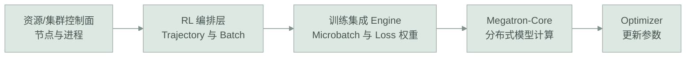

# 从 RL Trajectory 到 Megatron：Packed Sequence、MTP Mask 与 Loss 归一化

> 日期：2026-07-28
>
> 来源：当天基础理论对话
>
> 状态：已整理

## 整理记录

- 2026-07-28 晚间：整理从 Rollout Trajectory 到分布式训练 Tensor 的完整数据链。
- 本文补齐 `[B,S]`、Padding/Pack、Segment-aware MTP Label/Mask、有效 Token 归一化、混合精度和 DP/PP 归约的最小心智模型。
- 只记录通用 LLM/RL Infra 原理，不包含内部代码、路径、集群、配置和日志。

## 0. 今天最终要解决的问题

1. Rollout 产生的多条 Trajectory 怎样进入分布式训练？
2. 数据协调角色和 Ray Head 有什么区别？
3. `[B,S]`、Microbatch、Padding 和 Packed Sequence 分别是什么？
4. 为什么 MTP Label/Mask 不能对整个 Packed Tensor 直接 Shift？
5. 为什么动态长度 RL Batch 的 Loss 权重需要由上层编排框架参与计算？
6. “归约”、MTP Loss Weight、Microbatch Weight 和 Optimizer Loss Scale 有什么区别？
7. MTP Block 的 Dense/MoE 与推理时 Draft/Verify 是什么关系？

## 1. 先给结论

```text
Rollout Trajectories
→ Reward / Logprob / Advantage / Masks
→ 按有效 Token 数做数据分配
→ Padding 或 Packed Sequence
→ Tensor [B,S]
→ 拆成 Microbatches
→ 计算 Policy/MTP 有效 Token 数和 Loss Numerator
→ Megatron Forward/Backward Schedule
→ Optimizer Step
```

必须同时记住：

1. Ray Head 管集群，数据协调角色管训练 Batch，二者不是同一层。
2. DP 通常分 Trajectory/样本，CP 才沿一条长序列切上下文。
3. Packed Sequence 只是物理拼接，逻辑 Segment Boundary 不能消失。
4. 第 `j` 个 MTP 深度预测固定 Offset `j+1`，而不是预测所有未来 Token。
5. `mtp_loss_mask` 不只屏蔽 Padding，还要屏蔽 Prompt、Segment 尾部、越界位置和跨样本 Shift。
6. 动态长度 Batch 应按全局有效 Token 求平均，不能把每个 Microbatch 当成等重。
7. MTP 算法权重、Token/Microbatch 权重和 Optimizer Loss Scale 是三种完全不同的 Scale。
8. MTP Block 是训练时确定的模型结构；vLLM proposer 必须同构加载，推理时不能另选 Dense 或 MoE。

## 2. 先把系统层次分开



### 2.1 Ray Head 管什么

Ray Head 属于集群控制面，主要关心：

- 哪些节点加入集群；
- 有多少 CPU/GPU；
- Actor/Task 放在哪个节点；
- 进程状态和资源调度。

它不理解某个 Token 是 Prompt 还是 Response，也不知道哪些 Token 应进入 Policy Loss。

### 2.2 数据协调角色管什么

RL 编排层中的 Data Coordinator、DP Head 或 Controller 是逻辑角色，负责：

- 收到本轮 Trajectories；
- 根据长度或有效 Token 数分配数据；
- Collate、Padding 或 Packing；
- 生成训练所需的 Mask 和元数据；
- 把 Batch 交给训练 Engine。

它可能是某个 DP Group 的 Head Process，但不应直接等同于 Ray Head，也不一定意味着所有 Token 必须复制到一个全局单点。

## 3. Trajectory 到训练 Tensor 的对象变化

一条 RL Trajectory 通常不仅有文本：

```text
Prompt Token IDs
Response Token IDs
Old Logprobs
Reward / Advantage
Prompt/Response/Loss Mask
策略版本
序列长度与 Segment 元数据
```

进入训练前，编排层把多条 Trajectory 组成一个 Batch，再变成张量。

### 3.1 `[B,S]` 是什么意思

以 `input_ids` 为例：

```text
Shape = [B,S]
```

- `B`：Batch 中的物理行数；
- `S`：每行拥有的 Token 位置数。

进入模型后常见 Shape：

```text
input_ids:     [B,S]
hidden_states: [B,S,H]
logits:        [B,S,V]
```

其中：

- `H` 是 Hidden Size；
- `V` 是 Vocabulary Size。

`[B,S]` 只描述张量形状，不保证“一行一定只是一条逻辑样本”。

### 3.2 Padding

如果两条序列长度不同：

```text
样本 1：长度 5
样本 2：长度 8
```

可以补齐成统一长度 8：

```text
样本 1：5 个真实 Token + 3 个 Padding
样本 2：8 个真实 Token
```

Padding 位置必须通过 Mask 排除，避免进入 Attention 或 Loss。

### 3.3 Packed Sequence

Packing 会把多条短序列拼入一个更满的物理行：

```text
[A,B,C] + [X,Y,Z,W]
→ [A,B,C,X,Y,Z,W]
```

这样可以减少 Padding，但必须另外保存逻辑边界：

```text
Segment 1：[A,B,C]
Segment 2：[X,Y,Z,W]
```

Attention、Position、Label Shift 和 Loss Mask 都必须知道这个边界。物理上相邻不等于语义上属于同一序列。

## 4. DP Token 负载均衡到底做什么

DP 复制模型，让不同副本处理不同数据。如果只按样本数平均：

```text
DP Rank 0：2 条，每条 4,000 Token
DP Rank 1：2 条，每条 500 Token
```

样本数相等，但 Rank 0 的工作量远大于 Rank 1。更合理的目标是让有效 Token 数接近。

### 4.1 一条 Trajectory 会不会被拆到多个 DP Rank

通常在数据分配层，Trajectory 保持逻辑完整并分给某个 DP Rank：

```text
DP：分样本/Trajectory
CP：沿一条长序列切上下文
```

Packing 可以把多条完整 Trajectory 放入同一物理 Tensor，但不代表逻辑边界消失。具体框架是否存在特殊拆分必须看实现，不能只凭“Token 负载均衡”推断。

## 5. NTP/MTP Label 与 Segment-aware Mask

假设一个完整 Segment 是：

```text
[A,B,C,D,E,EOS]
```

固定 Offset 映射如下：

| Source | A | B | C | D | E | EOS |
|---|---|---|---|---|---|---|
| NTP `t+1` | B | C | D | E | EOS | Mask |
| MTP-1 `t+2` | C | D | E | EOS | Mask | Mask |
| MTP-2 `t+3` | D | E | EOS | Mask | Mask | Mask |

### 5.1 一层 MTP 不等于只训练一个位置

`mtp_num_layers=1` 通常表示增加一个 `t+2` 预测深度：

```text
A → C
B → D
C → E
D → EOS
```

它在所有有效 Source Position 上产生监督，但每个位置只对应一个固定未来 Offset。

### 5.2 为什么不能硬编码“最后 Mask 两位”

更稳妥的定义是：

```text
target_index = source_index + offset

valid =
  target_index < current_segment_end
  AND target token is not padding
  AND target token belongs to the allowed training region
```

如果 Tensor 是否包含 EOS Source Position、Prompt 是否参与 MTP Loss、序列是否被截断发生变化，固定的“最后 N 位”描述可能产生歧义；边界公式不会。

### 5.3 为什么全局 `roll(-2)` 会出错

Packed Tensor：

```text
[A,B,C | X,Y,Z]
```

若直接对整个 Tensor `roll(-2)`，Segment 1 尾部的 Source 可能得到 Segment 2 的 Token 作为 Label：

```text
B → X    # 错误，跨样本
C → Y    # 错误，跨样本
```

因此 MTP Label/Mask 必须以 Segment Boundary 为依据，或在 Shift 后显式屏蔽所有跨边界位置。

### 5.4 `mtp_loss_mask` 解决的不只是 Padding

它至少要排除：

- Padding；
- Prompt 中不属于目标训练区域的位置；
- 每条 Segment 末尾没有足够 Future Token 的位置；
- Packed Sequence 跨 Segment 的位置；
- 截断、无效或全 Mask Microbatch。

## 6. Loss Reduction：归约是什么意思

“归约”是把许多值合成为更少的值，例如：

```text
每个 Token 一个 Cross-Entropy
→ 对有效 Token 求和
→ 除以有效 Token 数
→ 一个平均 Loss
```

分布式场景还多一层：

```text
每个 DP Rank 的 local_loss_sum / local_valid_count
→ All-Reduce 汇总所有 Rank 的 numerator 和 count
→ global_loss_sum / global_valid_count
```

### 6.1 为什么不能平均各 Microbatch 的平均 Loss

假设：

```text
Microbatch 1：2,000 个有效 Token，平均 Loss=1
Microbatch 2：200 个有效 Token，平均 Loss=3
```

简单平均两个平均值：

```text
(1+3)/2 = 2
```

按 Token 正确加权：

```text
(2000×1 + 200×3) / 2200 ≈ 1.18
```

因此动态长度 RL Batch 需要 numerator/count 或等价的 Microbatch Weight。

### 6.2 为什么 Megatron 不能独自推断这个权重

Megatron-Core 擅长：

- 模型 Forward/Backward；
- TP/PP/DP 通信；
- Pipeline Schedule；
- Distributed Optimizer。

但它不天然知道：

- 哪些 Token 属于 Prompt/Response；
- 哪些 Token 的 Advantage 有效；
- Packed Segment 的语义边界；
- 本轮 RL 算法希望怎样归一化 Policy/MTP Loss。

这些信息存在于上层 RL Trajectory 和 Mask 中。因此常见分工是：

```text
RL 编排/集成层：定义有效 Token、numerator/count、Microbatch Weight
Megatron-Core：执行分布式计算、通信和 Optimizer
```

## 7. 必须区分的三种 Scale

| 名称 | 例子 | 作用 | 是否改变优化目标 |
|---|---|---|---|
| Algorithm Weight | `total = policy + λ_mtp × mtp` | 控制辅助目标相对重要性 | 是 |
| Token/Microbatch Weight | `valid_tokens / global_valid_tokens` | 保证动态长度 Batch 按 Token 正确平均 | 否 |
| Optimizer Loss Scale | `loss × 65536` | 低精度训练中避免梯度下溢 | 否 |

### 7.1 `λ_mtp` 是不是模型自己训练的

通常不是。它是人通过配置设置的超参数。也可以人为设计 Schedule，但默认不是一个参与 Backward 的可学习参数。

即使 `detach_encoder=true`，`λ_mtp` 仍然重要：它会缩放 MTP 专属参数的梯度。关闭 Detach 后，它还会影响 MTP Loss 对 Backbone/共享参数的作用强度。

## 8. 混合精度与 Optimizer Loss Scale

### 8.1 什么是混合精度

训练会同时使用不同数值格式：

```text
BF16/FP16：大量矩阵计算与激活
FP32：部分累积、Optimizer State 或敏感计算
```

目的通常是减少显存和带宽，并提高 GPU 吞吐，同时保留必要的数值稳定性。

### 8.2 为什么需要 Loss Scaling

FP16 的表示范围有限，极小 Gradient 可能下溢成 0。常见流程：

```text
原始 Loss × Scale
→ Backward 得到放大 Gradient
→ 检查 Inf/NaN
→ Optimizer 更新前除回 Scale
→ 使用还原后的 Gradient 更新参数
```

它不会让模型“更重视”这个 Loss，因为更新前会还原。BF16 的指数范围较大，通常不如 FP16 依赖动态 Loss Scaling，但实际行为由训练 Engine 和 Optimizer 配置决定。

MTP Loss 接入已有训练路径时，必须复用同一套 Scale/Unscale/Overflow 机制，不能重复放大，也不能绕过数值检查。

## 9. DP、PP 与 Loss 所有权的最低理解

### 9.1 DP

不同 DP Rank 处理不同数据，最终需要把梯度或 Loss 统计汇总。对于动态 Token 数，通常先汇总：

```text
loss numerator
valid token count
```

再形成全局平均。

### 9.2 PP

PP 把模型 Layer 分到多个 Stage。通常只有拥有最终输出/Loss 的 Stage 能直接产生 Loss，但所有 Stage 都必须按相同 Pipeline Schedule 参与 Forward/Backward 和必要的 Collective，避免有的 Rank 提前退出造成 Hang。

当前不需要记住每个 Collective API；先记住：

```text
谁能计算 Loss
≠ 只有谁需要参与 Backward/通信
```

## 10. MTP Block、MoE 与 Draft/Verify 的关系

这是三个不同分类维度：

```text
MTP Block：Drafter 内部采用什么神经网络结构
Dense / MoE：该 Block 的 FFN 是单一 Dense FFN 还是带 Router/Experts
Draft / Verify：推理算法中候选模型和 Target 模型的职责
```

所以推理阶段不是在 vLLM 中临时选择：

```text
“这次用 Dense MTP，下一次用 MoE MTP”
```

而是训练侧先确定 MTP 架构：

```text
训练构建 MTP Block
→ Checkpoint 保存其结构和参数
→ vLLM proposer 构建同构模块
→ 加载相同参数做 Draft
→ Target 模型做 Verify
```

如果 MTP Block 是 MoE，它自己的 Expert 参数可能需要 EP 分片和 Local→Global Expert 编号恢复；如果 MTP Block 是 Dense，它自身没有 Expert，但 MoE Target 主干仍可能在训练或推理中使用 EP。

结论：MTP Block 结构应遵循模型定义、成熟实现和 checkpoint ABI，不能由推理适配者随意发明。

## 11. 与已有知识的联系

- 与 [Qwen3 MoE 与 MTP 适配最小架构](Qwen3MoE与MTP适配最小架构_20260727.md) 的关系：本文把 TP/PP/EP、Adapter 和 MTP 契约推进到训练 Batch/Loss 层。
- 与 [MTP Head 状态机与训练适配边界](MTPHead状态机与训练适配边界_20260728.md) 的关系：本文补充从 Trajectory 到 MTP Label/Loss 的数据链和数值归一化。
- 与 [MTP Label、Loss 与参数更新](MTP标签损失与参数更新_20260726.md) 的关系：旧文解释单序列 Label/Loss；本文处理 Packed Sequence、Microbatch 和分布式归约。

## 12. 常见误解

| 容易误解为 | 更准确的理解 |
|---|---|
| DP Head 就是 Ray Head | 一个组织训练数据，一个管理集群资源；层次不同 |
| Token Load Balance 会把每条 Response 随意切到多卡 | DP 通常分配完整 Trajectory；沿序列切分更接近 CP |
| `[B,S]` 中一行一定是一条样本 | Packing 后一行可能含多个逻辑 Segment |
| MTP-2 让 A 同时预测后面所有 Token | 每个深度对应一个固定 Future Offset |
| `mtp_loss_mask` 只屏蔽 Padding | 还要处理 Prompt、Segment 尾部、越界、Packing 和截断 |
| 平均每个 Microbatch Loss 就是全局平均 | 动态 Token 数下必须按有效 Token 加权 |
| `λ_mtp` 只有 Joint Gradient 时才重要 | Detach 时仍决定 MTP 专属参数的梯度强度 |
| Optimizer Loss Scale 改变模型训练目标 | 它是可逆的数值稳定机制 |
| vLLM 可自行决定 MTP Block 用 Dense 还是 MoE | 推理结构必须与训练 checkpoint 同构 |
| 需要自己重写 Speculative Verifier | 通常应复用推理框架通用 Verify，只补模型特定 proposer/加载路径 |

## 13. 一分钟复习

1. Trajectory 经 Reward/Advantage/Mask 后被组织成动态长度 Batch，再 Padding/Pack 成 `[B,S]` Tensor。
2. Ray Head 管集群；数据协调角色管 Batch；训练集成 Engine 把 RL 语义交给 Megatron。
3. Packed Sequence 必须保留 Segment Boundary；MTP 多步 Label 不能全局 Roll。
4. 第 `j` 个 MTP 深度对应固定 Offset `j+1`，有效条件由目标是否仍在同一 Segment 决定。
5. 全局 MTP Loss 应按有效 MTP Token 的 numerator/count 归一化。
6. `λ_mtp`、Microbatch Weight 和 Optimizer Loss Scale 分别解决算法权重、统计口径和数值稳定。
7. MTP Block 的 Dense/MoE 是模型架构；Draft/Verify 是推理职责；二者不能混为一谈。

## 14. 自测问题

### 问题 1

为什么 DP 按样本数平均仍可能严重负载不均？

期望回答：Trajectory 长度差异很大；真正接近计算量的是有效 Token 数。

### 问题 2

`[B,S]` 中的 `B` 和 `S` 分别是什么？Packing 后一行是什么含义？

期望回答：`B` 是物理 Batch 行数，`S` 是每行 Token 位置数；一行可能包含多个有明确边界的逻辑 Segment。

### 问题 3

为什么不能对 `[A,B,C|X,Y,Z]` 直接做全局 `roll(-2)` 生成 MTP Label？

期望回答：会让前一个 Segment 尾部的 Source 指向后一个 Segment 的 Token，产生跨样本错误监督。

### 问题 4

`mtp_num_layers=2` 时，两个 MTP 深度分别预测什么？

期望回答：通常分别预测 `t+2` 和 `t+3`；不是每个位置同时预测所有未来 Token。

### 问题 5

为什么不能直接平均各 Microbatch 的平均 Loss？

期望回答：Microbatch 有效 Token 数不同；应按 numerator/count 或等价权重形成全局 Token 平均。

### 问题 6

`λ_mtp` 和 Optimizer Loss Scale 有什么本质区别？

期望回答：前者改变 MTP 辅助目标及梯度相对权重；后者更新前会还原，只用于低精度数值稳定。

### 问题 7

MTP Block 是 Dense 还是 MoE，能否由 vLLM 推理适配时自由选择？

期望回答：不能；它是训练模型/checkpoint 的结构契约，推理 proposer 必须同构加载。

## 15. 尚未解决与后续路线

- 具体训练框架是在 Collate、Engine 还是模型内部生成 Future Label，需要沿目标代码路径确认。
- Prompt Token 是否参与 MTP auxiliary loss、共享 Embedding/LM Head 的 Detach 范围，需要明确训练契约。
- CP>1 下跨 Rank Future Label/Embedding 的通信方案仍待深入。
- 不同 Megatron 版本对 MTP Label 的内部 Shift 语义可能不同，必须用小序列单测，而不是只凭概念实现。

## 16. 公开参考材料

- [Megatron-Core](https://github.com/NVIDIA/Megatron-LM)
- [PyTorch Automatic Mixed Precision](https://docs.pytorch.org/docs/stable/amp.html)
- [AReaL #1445：MTP-augmented SFT/RL training](https://github.com/areal-project/AReaL/pull/1445)
- [vLLM MTP](https://docs.vllm.ai/projects/speculators/en/latest/user_guide/algorithms/mtp/)
