# MoE Router Replay 与训推路由一致性

> 日期：2026-08-17
> 来源：Codex Session `019ff9e1-ec72-7a23-8c0e-e63ba1bc8269`
> 状态：已整理

## 0. 这篇笔记最终要解决的问题

MoE Rollout 与 Actor Training 使用相同模型时，为什么还需要 Replay Expert Route？到底应该传 Expert IDs、Router Weights 还是完整路由输出？如何判断 Capture、Ray 传输、Activation Recompute 和 CUDA Graph 下的路由真的对齐？

## 1. 先给结论

1. Online Router Replay 固定的是本轮 Rollout 实际选择的离散 Expert IDs，不是冻结旧 Router，也不是传输旧权重。
2. Actor 仍用当前 Hidden State 和当前 Router 参数计算 Scores，再对 Forced IDs Gather 并按模型原生规则重新计算权重，所以训练侧 Router 仍可获得梯度。
3. Capture 应保存 logical Expert IDs，位置在 Top-K 之后、EPLB logical→physical 映射和 Token Dispatch 之前。
4. 原始路由必须经过 Causal Shift、Token/Layer 对齐、Packing、PP/VPP/CP 重排后才能进入 Actor；Shape 对了不等于语义对了。
5. 不同 batch 调度下自然 Top-K 可能不同，这不自动说明 Capturer 串请求。正确性要求是每条 Trajectory 使用它自己当次 Rollout 的路线。
6. 文件落盘只应是可选 Debug 旁路；正常 Online Replay 应随 Trajectory 通过内存/Ray 数据面传输。

## 2. 为什么会有训推 Expert Route 不一致

MoE Router 对每个 Token、每个 MoE Layer 计算：

$$
s=\operatorname{Router}(h)
$$

然后取 Top-K Expert：

$$
I=\operatorname{TopK}(s)
$$

即使 Rollout 和 Actor 的 Token 完全相同，以下差异也可能让靠近 Top-K 边界的 Expert 交换顺序或集合：

- 推理与训练 Kernel/精度不同；
- Batch 形状、并发调度不同；
- Tensor/Expert Parallel 执行顺序不同；
- CUDA Graph 与 Eager 的数值路径不同；
- Actor 权重已经有少量更新；
- Hidden State 的舍入误差累积。

如果 Actor 在 `compute_old_log_prob` 或 Policy Update 时重新自然 Top-K，实际执行的 Expert 可能不是生成这条 Trajectory 时的 Expert。此时“Token 相同”仍不等于“内部稀疏计算图相同”。

Router Replay 的目的就是把当次 Rollout 的离散路径作为 Trajectory 的一部分带回训练侧。

## 3. 完整数据链

```mermaid
flowchart LR
    R["Rollout Router Scores"] --> T["Top-K logical Expert IDs"]
    T --> C["Capture"]
    C --> A["Causal Shift + Token/Layer 对齐"]
    A --> P["Trajectory / RTensor / Ray"]
    P --> D["Actor Microbatch、PP/VPP/CP 重排"]
    D --> S["当前 Actor Router Scores"]
    S --> G["Gather Forced IDs"]
    G --> W["按原生语义重算 Weights"]
    W --> E["Dispatch 到指定 Experts"]
    E --> B["Backward 保留 Router 梯度"]
```



四段职责：

1. Capture：获取本次推理真正选择的 logical Top-K IDs；
2. Alignment：把推理行、训练 Token、MoE Layer 对齐；
3. Transport：路由随本轮 Trajectory 进入 Actor；
4. Replay：Actor 强制使用这些 IDs，但重新计算当前权重。

## 4. 为什么只传 Top-K IDs，不传 Top-K Weights

训练侧应执行：

```python
scores = training_router(hidden_states)
forced_ids = rollout_routed_experts
selected_scores = scores.gather(-1, forced_ids)
forced_weights = apply_native_normalization(selected_scores)
```

如果直接传 Rollout 的旧权重并替换训练权重：

- Actor 当前 Router 参数与权重计算断开；
- Router Gradient 可能消失或语义错误；
- 推理/训练不同的 Softmax、Sigmoid、Renormalize、Scaling 规则可能混用；
- 数据量也更大。

只传 IDs 的语义是：

```text
离散选择：沿用生成这条数据时的 Expert 路径
连续权重：用当前 Actor Router 重新计算
```

梯度会流向被 Forced IDs 选中的当前 Scores 和相关 Router 参数。Top-K 的离散选择本身不可导，但 Replay 并不需要对“重新选谁”求导；它需要在固定路径上训练当前路由分数。

## 5. 为什么必须捕获 Logical Expert IDs

Expert Parallel 或 EPLB 可能把逻辑 Expert 重新映射到不同设备/物理槽位：

```text
Logical Expert 17
→ 当前运行时可能位于某个 Rank 的 Physical Slot 3
```

物理位置会随部署拓扑和负载均衡布局变化，逻辑模型身份才是跨推理/训练环境稳定的 ABI。因此 Capture 的位置应在：

```text
Router Top-K 完成之后
EPLB logical→physical 映射之前
Token Dispatch 之前
```

训练侧再根据自己的 EP 拓扑把 Logical IDs 映射到本地物理 Expert。

## 6. Token 与 Layer 对齐为什么最危险

推理侧原始路由常对应 Next-Token Logits 的行。若输入有 $S$ 个 Token，能够产生 next-token 预测的有效行可能是 $S-1$。训练侧通常希望得到：

```text
[B, S, num_moe_layers, top_k]
```

所以需要明确：

- 第 $i$ 行路由对应哪个 Input/Output Token；
- Prompt Token 和 Response Token 哪些有效；
- EOS、Padding、截断如何 Mask；
- Packed Sequence 中 Segment Boundary 在哪里；
- 推理侧 MoE Layer 顺序怎样映射到 Megatron 的 PP/VPP Local Layer；
- CP 切分后每个 Rank 应拿哪些 Token 行。

最危险的错误不是 Shape 报错，而是所有 Shape 都对、路由却整体偏移一位或错一层。

## 7. Online Transport 与 Debug 落盘

正常链路应是：

```text
本轮 Rollout Capture
→ 与 Trajectory 对齐
→ RTensor / Ray Object Store
→ 本轮 Actor 使用
```

Route 只应传给需要 Replay 的 Actor，避免 Reference、Critic、Teacher 无效拉取。

Debug 落盘是旁路：

- 保存推理侧捕获并已对齐的 `topk_ids`；
- 附带 Step、Rank、Shape、DType、有效 Token/Layer 信息；
- 默认关闭，不参与正常训练；
- 可把阻塞式文件 I/O 放入线程，避免直接阻塞事件循环；
- 不等于从历史文件加载并跨运行 Replay，后者是另一项 Offline 功能。

因此 `R3` 表示同一训练轮次内的 Replay 语义：路由随 Trajectory 走内存/Ray 主链路，Debug 文件不是训练输入。

### 7.1 2026-08-26 实现边界补充

当前实现语义需要更精确地区分“异步 API”和“真正后台写入”：

```text
await asyncio.to_thread(torch.save, ...)
```

表示 `torch.save` 在工作线程执行，所以不会直接卡住 asyncio Event Loop；但调用方仍然 `await` 文件写完后才继续完成 Trajectory。因此它：

- 不是 Fire-and-forget；
- 不是有界后台队列；
- NAS 较慢时仍可能增加 Rollout 尾延迟；
- 写盘失败不会让 R3 改成从磁盘读取；
- 只要 Debug 路径非空，当前实现可能对每条带路由的完成 Trajectory 落盘，而不是自动抽样。

推荐边界：

```text
正确性 Smoke：
R3 主链路 + 少量 Debug Dump，方便检查 Shape/对齐

正式性能测试或长训练：
R3 主链路保留，Debug Dump 关闭
```

若以后要长期开启，应增加“有界后台队列 + 抽样率 + 退出时 Flush + 丢弃/失败指标”，才能更接近真正不阻塞的诊断旁路。

## 8. Route Tensor 的数据量与 Ray 成本

若每个有效 Token 记录 $L$ 个 MoE Layer、每层 Top-K 个 Expert，ID 使用 4 Byte：

$$
\text{route bytes}
\approx B\times S\times L\times K\times4
$$

例如 $L=40,K=8$：

```text
每 Token：40 × 8 × 4 = 1280 Byte ≈ 1.25 KiB
32K Token：约 40 MiB / 序列
128K Token：约 160 MiB / 序列
```

这还不含 Mask、Shape 和对象元数据。性能分析至少要拆分：

- GPU Capture 与 D2H；
- `ray.put`；
- `ray.get`；
- H2D；
- PP/CP/EP 内部重排和分发；
- Object Store used/spilled/restored bytes。

必须用 Route Off/On 的严格 A/B 解释增量。某个 `ray_get_batch_ms` 若同时包含其他 Trajectory 字段，不能直接称为“纯路由 Get 时间”。

### 8.1 Ray ObjectRef 到消费端的数据流

Ray Object Store 不是一个集中式内存池，而是每个节点都有自己的对象存储。

```text
Producer ray.put(route)
→ 序列化并写入 Producer 节点 Object Store
→ 返回一个很小的 ObjectRef

Consumer ray.get(ref)
→ 对象已在本地：直接读取
→ 对象在远端：跨网络拉到 Consumer Object Store
→ 对象已 Spill：先从磁盘/外部存储恢复
→ 反序列化或映射给消费者
```

因此 `ray.get` 耗时可能同时包含：等 Producer、网络传输、Object Store 写入、Spill Restore 和反序列化/拷贝。`ray.put` 也不是免费广播，它只是先写生产者所在节点。

### 8.2 为什么每个 Actor DP Group 只 Get 一次

理想数据面是：

```text
Rollout Capture
→ ray.put
→ Actor DP Group Head ray.get 一次
→ H2D 一次
→ NCCL Broadcast 给该 DP Group 的 TP/EP Ranks
→ 各 Microbatch 只做 Local Slice
```

要避免：

- 每个 Rank 都独立 `ray.get`；
- 每个 Microbatch 重复 `ray.get`/H2D；
- 拆成大量小 ObjectRef，让调度和序列化开销主导；
- 对象被驱逐后又在同一轮重复跨节点拉取。

性能目标可以记成：每个 Actor DP Group 只做一次物理本地化、一次 H2D，之后利用训练拓扑内部 Collective 分发。

### 8.3 Spill 与 NCCL 不是一回事

Object Store 共享内存压力过大时，Ray 会把对象 Spill 到磁盘或外部存储；之后的 `get` 必须 Restore。这会增加磁盘 I/O、额外拷贝和尾延迟波动，所以要观测 Object Location 以及 Spilled/Restored Bytes。

NCCL 则负责 GPU Rank 之间的 Collective，并不要求一定有 NVLink：

- 节点内优先 NVLink/NVSwitch，其次 PCIe P2P，必要时可经 Host Staging；
- 跨节点通常使用 IB/RoCE，也可能退化到 TCP。

所以“Ray 对象 Spill”、“Ray 跨节点 Get”和“NCCL Broadcast 走什么链路”必须分开定位，不能一律归因为 NVLink 或网络问题。

### 8.4 Route Replay 的性能优化顺序

1. 只传有效 Token 和实际 MoE Layer，先从语义上消除 Padding/无用行；
2. 使用紧凑的整数 Expert IDs，不传旧 Router Weights；
3. 每个 DP Group 一次 Get + H2D，再用 NCCL 向 TP/EP Rank 扩散；
4. 控制 In-flight Trace 数量，避免 Object Store Spill；
5. 再优化 Pinned H2D、Validation、逐层 Cast/Padding 和小粒度 Kernel。

大 Payload 下 `ray.put/get` 可能比 H2D 更显著，小 Payload 下又可能几乎不可见。这是需要 Route Off/On 严格 A/B 证明的实验结论，不是只靠公式就能确定的固定瓶颈。

## 9. 自然路由差异不等于 Capture 错误

需要区分三种比较：

### 9.1 同模式、同调度重复

相同权重、请求、Batch 形状和执行模式重复运行，Token 和 Expert-ID Set 应稳定。这适合作为 Capture 正确性的硬门禁。

### 9.2 串行与并发调度比较

相同 Prompt 在不同 Batch/并发形状下，即使输出 Token 相同，自然 Router Top-K 仍可能因数值路径变化出现少量 Drift。它更适合记录为诊断指标，而不是要求 100% 相等。

### 9.3 Eager 与 CUDA Graph 比较

需要分别验证各自 Capture 的 Shape、ID 范围、Token/Layer 对齐和同模式重复稳定性。跨模式差异要区分：

- Top-K 顺序变化；
- 排序后的 Expert 集合变化；
- 真正的 Token/Request 混线；
- Graph Buffer 地址复用或有效长度错误。

所以 Route Match 至少要同时报告 Ordered Match 和 Set Match，不能只用一个布尔值。

## 10. Activation Recompute 下为什么还要 Replay

训练 Forward 第一次使用 Forced IDs 后，Backward 期间的 Recompute 必须再次使用同一 Microbatch、同一 Token、同一 Layer 的 IDs。

如果 Recompute 静默回退到自然 Top-K：

```text
第一次 Forward：Expert A/B
Backward Recompute：Expert A/C
```

那么重算的 Activation 与原 Forward 不一致，Gradient 语义被破坏。正确门禁应显式记录：

- Forward Forced Route 已启用；
- Recompute Forced Route 已启用；
- Mismatch Rows 为零；
- Router Grad finite 且非零；
- Loss/Logprob finite。

## 11. 正确性验证阶梯

### C0：纯训练侧单测

- S-1 Causal Shift；
- BSHD/THD Packing；
- 非法/重复 Expert ID；
- Forced-ID Gather；
- Router Gradient。

### C1：真实推理 Capture

- 每份 Capture 独立验证 Shape、层数、Top-K 和 ID 范围；
- 先持久化诊断摘要，再比较；
- Eager/Graph 各自做同模式重复；
- Serial/Concurrent Drift 只做诊断；
- Ordered Match 与 Set Match 分开。

### C2：端到端 Actor Step

- Trajectory 经 Ray 到 Actor；
- PP/VPP/CP 重排后逐 Token/Layer 对齐；
- Forward/Recompute 都实际使用 Forced IDs；
- Router Gradient、Loss、Logprob 有限；
- 至少一次 Optimizer Update 成功。

只有 C0 通过，不能声称 Ray、CUDA Graph 或端到端 Replay 已验证。

## 12. 性能 A/B 原则

Route Off/On 两组必须固定：

- 模型权重与 Commit；
- 输入与 Seed；
- 并行拓扑；
- Sampling 与输出长度；
- CUDA Graph 状态；
- Prefix Cache 状态；
- Warmup 和测量 Step。

先跑正确性和无 Spill 的短序列，再扩到长序列。主要比较：

- Rollout Tokens/s；
- Actor/Train/End-to-End Step Time；
- D2H、Ray Put/Get、H2D 增量；
- Host/GPU Memory；
- Object Store Spill；
- Route Tensor Byte 数。

## 13. 常见误解

| 容易误解为 | 更准确的理解 |
|---|---|
| Replay 是把旧 Router 权重复制到 Actor | 只固定 Expert IDs，权重由当前 Router 重算 |
| 需要同时传 `topk_ids` 和 `topk_weights` | 通常只传 IDs，保留当前训练语义和梯度 |
| 相同 Token 的自然 Route 必须在任何 Batch 下相同 | 数值和调度路径可能造成 Top-K 边界 Drift |
| Serial/Concurrent Route 不同就证明 Capturer 串请求 | 还需分别验证每份 Capture、同模式重复和 Token/层对齐 |
| Physical Expert ID 可以跨系统直接传 | 应传稳定的 Logical ID，再按训练拓扑映射 |
| Debug 文件是 Online Replay 的主数据面 | 正常路径走内存/Ray，落盘只是可选诊断 |
| `asyncio.to_thread` 就是完全异步后台落盘 | 若调用方仍 `await`，事件循环不被阻塞，但 Trajectory 完成仍会等待 I/O |
| Forward 使用 Forced IDs 就够了 | Recompute 也必须复用同一 IDs |

## 14. 一分钟复习

1. Capture Rollout 当次的 logical `topk_ids`，不要传旧 Router 权重。
2. Actor 用当前 Scores Gather Forced IDs，再按原生规则重算权重，因此保留 Router Gradient。
3. 路由 Tensor 必须经过 Causal Shift、Token/Layer、Packing 和 PP/VPP/CP 对齐。
4. 同模式重复稳定是硬门；跨 Batch 的自然 Route Drift 是诊断，不自动等于 Capture Bug。
5. R3 Replay 走 Trajectory/Ray；Debug 落盘默认关闭，`to_thread + await` 仍可能增加尾延迟；Recompute 必须复用同一路由。

## 15. 自测问题

### 问题 1

为什么只传 Expert IDs 能同时实现路径一致和训练侧 Router 更新？

期望回答：离散路径由 Rollout IDs 固定，连续权重由当前 Actor Router Scores 在 Forced IDs 上重新计算，梯度仍流向当前 Router 参数。

### 问题 2

为什么串行和并发请求的 Expert Route 不完全一致，不能直接判定 Capturer 串请求？

期望回答：Batch 形状和数值执行顺序可改变靠近 Top-K 边界的自然路由；应先验证每份 Capture 独立有效、同模式重复稳定及请求/Token/层对齐。

### 问题 3

为什么 Recompute 必须拿到同一份 Forced IDs？

期望回答：Backward 重算必须复现原 Forward 的稀疏计算图，否则 Activation 和 Gradient 对应不同 Expert 路径。

## 16. 与已有知识的联系

- [Transformer 残差、MLP 与 MoE 路由](../07/Transformer残差MLP与MoE路由_20260728.md)：旧文解释自然 Top-K 与 Expert 加权；本文补充路由成为 Trajectory 数据后的训推契约。
- [Qwen3 MoE 与 MTP 适配最小架构](../07/Qwen3MoE与MTP适配最小架构_20260727.md)：旧文解释 Logical/Physical Expert 编号和 EP；本文说明为何 Replay 必须传 Logical IDs。
- [On-policy 训推、Logprob 与 MTP 性能分析](OnPolicy训推与MTP性能分析_20260806.md)：Router Replay 与 Old Logprob 一样，都强调训练必须忠实描述真正生成本批数据的 Behavior Path。

## 17. 尚未解决与后续路线

- Router Load-Balance Auxiliary Loss 在 Forced Route 下应如何定义和观测。
- EPLB 动态重映射、EP All-to-All 与 Replay 的性能交互。
- SGLang Capturer、异步多轮对话和跨运行 Offline Replay。
- 长上下文下 Route Tensor 压缩、稀疏编码与传输流水化。
