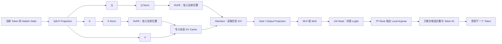

# 推理算子位置图与性能归因

> 日期：2026-08-11
> 补录：2026-08-17
> 来源：Codex Session `019f8eb0-3132-7d80-97b8-cb4f1ec90f2b`、`019f8e1a-1ff1-7002-aa46-85ffd51a11cc`、`019fd6ac-5ea6-70f2-99ff-0e78d6a12731`
> 状态：已整理

## 0. 这篇笔记最终要解决的问题

进入 MTP 性能分析后，经常会同时看到 `QK Norm`、`RoPE`、`Slot Mapping`、`Rejection Sampling`、`Local Argmax` 和 Triton Fusion。它们到底位于推理链路的哪里？什么问题适合写一个轻量融合 Kernel，什么问题已经接近硬件或算法的物理上限？

## 1. 先看完整位置图



先分清四个层次：

| 概念 | 所属层次 | 主要解决什么 |
|---|---|---|
| QK Norm | 模型 Attention 结构 | 稳定 Q/K 数值尺度 |
| RoPE | 模型位置编码 | 让 Q/K 匹配包含相对位置信息 |
| Attention / LM Head | 模型主计算 | 读取历史信息、产生词表分数 |
| Local Argmax | TP 推理系统优化 | 避免聚合完整分片 Logits |
| Position ID / Slot Mapping | 推理运行时元数据 | 把逻辑位置映射到位置编码和物理 KV 槽位 |
| Rejection Sampling | 投机解码算法 | 决定 Draft 接受前缀和状态提交 |

## 2. QK Norm：先稳定“查询”和“索引”的尺度

Hidden State 投影后得到：

$$
Q=XW_Q,\qquad K=XW_K,\qquad V=XW_V
$$

标准 Attention 分数包含：

$$
\operatorname{score}_{ij}=\frac{Q_iK_j^\top}{\sqrt{d}}
$$

如果某个 Q/K 只是向量长度异常大，点积就可能异常大，Softmax 会变得过度尖锐。QK Norm 会在 Q/K 投影后、RoPE 前，分别做 RMSNorm：

$$
\hat Q=\operatorname{RMSNorm}(Q),\qquad
\hat K=\operatorname{RMSNorm}(K)
$$

直觉上：

```text
向量方向：表达“我要找什么 / 我是什么信息”
向量长度：数值尺度

QK Norm：先把长度拉回稳定范围，
让 Attention 更关注方向匹配，而不是被异常尺度支配。
```

QK Norm 不等于 Transformer Layer 外面的 Hidden-State RMSNorm：前者处理每个 Attention Head 的 Q/K，后者处理进入整个 Attention/MLP 子层的 Hidden State。

性能上，Decode 时 QK Norm 主要处理本轮活跃 Token 的 Q/K，通常不会因为历史位置从 4K 增加到 128K 而线性增长。因此它可能形成固定的小 Kernel 开销，但通常不是长上下文线性变慢的根因。

## 3. RoPE：把 Token 位置编码进 Q/K 的方向

RoPE（Rotary Position Embedding）不是简单给 Hidden State 加一个位置向量，而是按照 Token 位置旋转 Q/K 的成对维度：

$$
\begin{bmatrix}q'_1\\q'_2\end{bmatrix}
=
\begin{bmatrix}
\cos\theta_t&-\sin\theta_t\\
\sin\theta_t&\cos\theta_t
\end{bmatrix}
\begin{bmatrix}q_1\\q_2\end{bmatrix}
$$

可以把它理解为“内容箭头 + 位置指南针”。两个位置的旋转向量做点积时，结果自然包含相对距离：

$$
(R_iQ)^\top(R_jK)=Q^\top R_{j-i}K
$$

Decode 时不会重新旋转所有历史 K：

```text
历史 K：生成时已经做过 RoPE，并保存在 KV Cache
当前 Token：只为当前 Q/K 做 RoPE
Attention：当前 Q 再查询全部历史 K/V
```

所以必须区分：

- RoPE 当前计算量主要随本轮 Query Token 数变化；
- Full Attention 的历史 KV 读取量随当前位置增长。

`Position ID` 是 Token 的逻辑序号，RoPE 用它决定旋转角度；它与 KV Cache 的物理地址不是一个概念。

## 4. QK Norm + RoPE Fusion 能优化什么

未融合时可能是：

```text
QKV Projection
→ Q Norm Kernel
→ K Norm Kernel
→ Q RoPE Kernel
→ K RoPE Kernel
→ KV Cache Write
```

每一步都可能产生 Kernel Launch 和中间 Tensor 的读写。融合后，一个 Kernel 可以连续完成 Norm、旋转和 Cache Write，减少：

- 小 Kernel 启动次数；
- 中间 Tensor 落显存；
- Kernel 之间的同步和调度空洞。

但它不能消除：

```text
当前 Q × 全部历史 K/V
```

因此它减少的是固定碎片开销，不改变 Full Attention 每个 Decode Step 对历史长度近似 $O(T)$ 的读取量。

上游 Patch 还可能绑定模型、版本、CUDA/ROCm 后端和 Attention Backend。复用前必须核对匹配条件和数值/CUDA Graph 回归，不能因为名字相似就直接套用。

## 5. Local Argmax：减少 TP 词表聚合，不减少 LM Head 计算

Tensor Parallel 下，词表维度可能分到多张卡：

```text
Rank 0：词表分片 0
Rank 1：词表分片 1
...
```

朴素做法是 All-Gather 全部 Logits，再做全局 Argmax。Local Argmax 则是：

1. 每张卡在本地词表分片中选最大分数和对应全局 Token ID；
2. 每张卡只发送这一对候选；
3. 在少量候选中选择全局最大值。

对于 Greedy/Top-1，数学上这是精确等价的，因为全局最大值一定是某个分片的局部最大值。

它省掉的是：

- 完整 `[Batch, Vocab]` Logits 的跨卡聚合；
- 部分完整 Logits 的落显存和通信。

它不能省掉：

- LM Head 的矩阵乘法；
- LM Head 权重读取；
- 下一个 Draft Step 对前一个 Token 的自回归依赖。

普通 Local Argmax 也不能直接替代 Top-k、Top-p 或温度采样，因为这些算法需要更多分布信息。

## 6. Position ID、Slot Mapping 与 Rejection Sampling

### 6.1 Position ID

表示 Token 在逻辑序列中的位置，主要服务 RoPE 等位置机制。

### 6.2 Slot Mapping

Paged KV Cache 的物理内存不是按“请求 1 从头连续到尾”简单分配。Slot Mapping 负责：

```text
请求中的逻辑 Token 位置
→ KV Block 编号
→ Block 内 Offset
→ 实际读写槽位
```

### 6.3 Rejection Sampling

投机解码中，Target 对 Draft 候选评分后要确定：

- 最长接受前缀；
- 首个拒绝位置；
- 修正或 Bonus Token；
- 哪些临时 KV/State 可以提交。

这些逻辑带有分支和状态依赖，若被拆成许多 CPU/GPU 往返和小 Kernel，就可能成为“调度碎算子”。

## 7. 调度碎算子与硬性物理极限

### 7.1 调度碎算子的 Trace 特征

```text
大量很短的 Kernel
+ Kernel 之间明显空洞
+ CPU Launch / Python / memcpy / sync 较多
+ GPU 经常等待下一项工作
```

典型来源包括 Metadata、Position/Slot Mapping、Rejection、多个独立 Norm/RoPE Kernel。适合的方向是：

- 合并小 Tensor 操作；
- 缓存或复用元数据；
- 减少 CPU/GPU 同步；
- 回移已验证的上游 Fusion；
- 使用 CUDA Graph 稳定执行序列。

### 7.2 物理极限的 Trace 特征

```text
少数很长的 Attention / GEMM Kernel
+ GPU 时间连续被占满
+ Attention 耗时随 Position 近似线性增长
+ NCU 显示 DRAM 吞吐接近带宽上限
```

这时用 Triton 重写“语义相同、数据搬运量相同”的 Kernel，通常无法获得数量级收益。更有效的方向往往需要改变被搬运的数据量或算法：Sliding Window、KV 量化、降低 Draft K、改变 Attention/Cache 结构等。

PyTorch Profiler/Perfetto 适合回答“时间花在哪里”；NCU 才更适合回答“是否已接近 HBM 带宽上限、实际读了多少 DRAM/L2 数据”。

## 8. 为什么 K=2 不能简单合成一次大 Kernel

线性 MTP Draft 存在严格依赖：

```text
Draft 1 Forward
→ LM Head / Sampling
→ 得到 Token 1
→ Token 1 Embedding
→ Draft 2 Forward
```

第二步输入在第一步选出 Token 前不存在，因此两步不能像两个已知样本那样组成普通 Batch。即使写 Persistent Kernel，片上 Cache 也通常装不下完整 LM Head 分片和长上下文 KV。可以融合单步内部的小操作，但不能凭 Kernel Fusion 消除自回归依赖和大规模权重/KV 读取。

## 9. Trace 后的决策表

| Trace 现象 | 更可能的结论 | 下一步 |
|---|---|---|
| QK Norm/RoPE/Gate 是许多短 Kernel | 固定调度碎片 | 匹配上游 Fusion 并做 A/B |
| 完整词表 Logits 在 TP 间聚合 | 通信/物化过量 | Greedy 场景测试 Local Argmax |
| Metadata/Slot/Rejection 占比高 | 运行时碎片 | 小型融合、缓存、减少同步 |
| Draft Attention 随 Position 线性增长 | 历史 KV 扫描 | 用 NCU 验证带宽与实际读量 |
| LM Head 重但不随 Position 增长 | 固定词表投影成本 | 区分 GEMM、权重读取和通信 |
| QKV/MLP/LM Head 也随 Position 增长 | 可能误走 Prefill/Graph Padding | 先查形状与执行路径 |
| GPU 连续忙且接近带宽上限 | 物理搬运上限 | 改数据量/算法，不盲目重写 Kernel |
| GPU 大量等待 CPU | 调度与同步瓶颈 | 优先融合、Graph 和 Metadata 复用 |

## 10. 常见误解

| 容易误解为 | 更准确的理解 |
|---|---|
| QK Norm 是长上下文变慢的主要原因 | 它通常只处理当前活跃 Q/K；历史 KV 扫描更可能随 Position 增长 |
| RoPE 每步重新处理全部历史 K | 历史 K 生成时已旋转并缓存 |
| Local Argmax 避免 LM Head 计算 | 它主要避免完整 Logits 聚合，LM Head 仍要计算 |
| Triton 能优化任何 GPU 热点 | 若同样的数据必须从 HBM 搬运，换实现很难突破带宽墙 |
| 上游 Patch 合并过就可以直接回移 | 还要匹配模型、版本、硬件后端、执行图和数值契约 |

## 11. 一分钟复习

1. QK Norm 稳定 Q/K 尺度；RoPE 按 Position 旋转 Q/K；Attention 再用当前 Q 查询历史 K/V。
2. Local Argmax 是 TP 推理优化：每卡先选本地冠军，只聚合少量候选；它不消除 LM Head GEMM。
3. 小 Kernel、CPU/GPU 空洞和元数据往返属于调度碎片；长 Attention/GEMM 接近 HBM/算力上限属于物理瓶颈。
4. Fusion 减少中间读写和 Launch，不会自动改变 Full Attention 的历史 KV 读取量。
5. 先用 Profiler 定位时间，再用 NCU 验证带宽；证据不足时不要先写“大融合 Kernel”。

## 12. 自测问题

### 问题 1

为什么 QK Norm + RoPE Fusion 可能降低固定开销，却无法解决 128K Full Attention 的历史扫描？

期望回答：Fusion 合并的是当前 Q/K 的 Norm、旋转和 Cache Write；当前 Q 仍要读取同样数量的历史 K/V。

### 问题 2

为什么 Greedy Sampling 可用 Local Argmax 精确替代完整 Logits All-Gather？

期望回答：全局最大值必然是某个词表分片的局部最大值，只需比较每个分片的最大分数和 Token ID。

### 问题 3

看到 Attention Kernel 很长时，为什么不能立即断定已达到 HBM 上限？

期望回答：Profiler 只能先说明时间位置；还需要 NCU 或等价硬件计数器确认 DRAM/L2 流量、带宽利用率和 Stall 原因。

## 13. 公开参考材料

- [RoPE 原始论文](https://arxiv.org/abs/2104.09864)
- [Hugging Face Transformers 的 Qwen3.5 实现](https://github.com/huggingface/transformers/blob/main/src/transformers/models/qwen3_5/modeling_qwen3_5.py)
- [vLLM Local Argmax PR](https://github.com/vllm-project/vllm/pull/39419)
- [vLLM QK Norm、RoPE 与 KV Cache Fusion PR](https://github.com/vllm-project/vllm/pull/42749)
